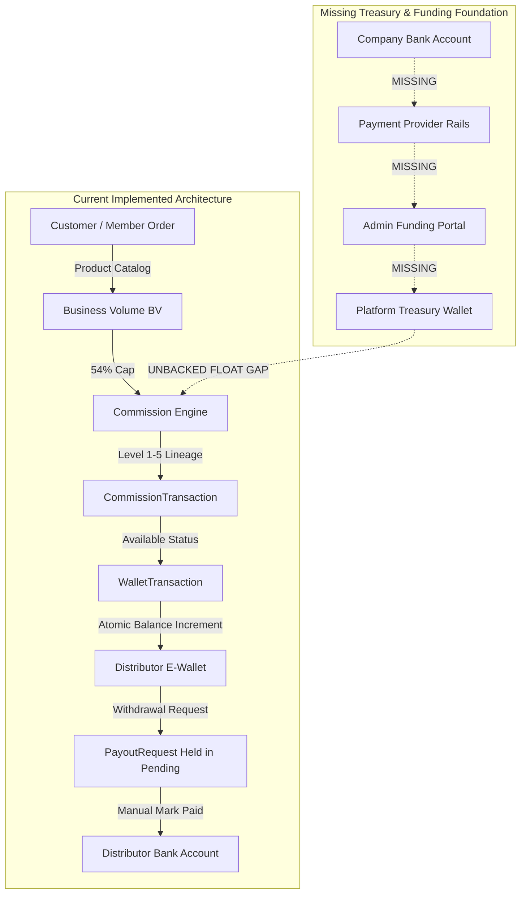
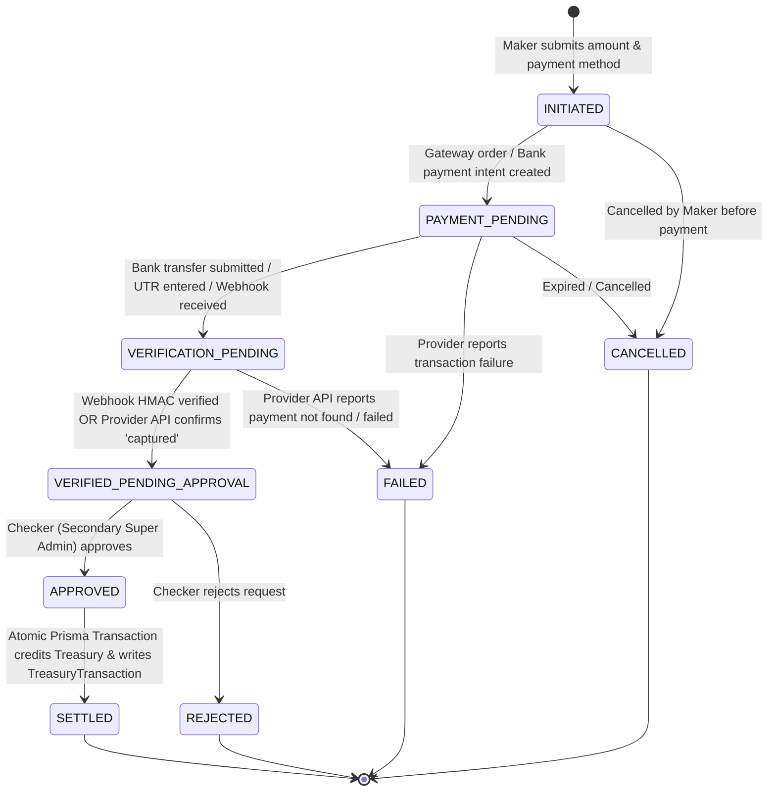
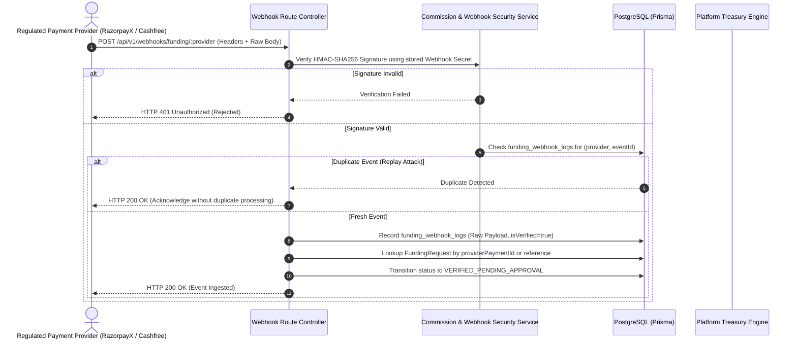

# KashviMLM Admin Funding Portal — Financial & Treasury Architecture Specification

> **Document Version**: 1.0.0  
> **Status**: APPROVED ARCHITECTURAL SPECIFICATION (Pre-Implementation Analysis)  
> **Target Module**: Admin Funding Portal & Platform Treasury Wallet Engine  
> **Companion Documents**: `COMMISSION_SYSTEM.md`, `COMMISSION_IMPLEMENTATION_PLAN.md`, `schema.prisma`

---

## Executive Summary & Non-Negotiable Financial Invariants

This specification defines the architectural blueprint for the **Admin Funding Portal** and **Platform Treasury Wallet System** in the KashviMLM platform. 

The primary business objective is to allow authorized company administrators to connect the company's regulated banking/payment provider, monitor liquidity, initiate corporate treasury funding, verify bank transactions, and atomically credit the platform treasury.

### ⚠️ Absolute Financial Integrity Rule
Under **no circumstances** may this system be implemented as:
$$\text{Admin inputs amount} \longrightarrow \text{Database balance } += \text{ amount}$$

In a production financial and MLM enterprise system, direct ledger manipulation without verified external proof is an audit violation and a severe financial security hazard. 

**Core Financial Invariants**:
1. **Zero Unbacked Credits**: The platform treasury balance must **only** increase following either:
   - Cryptographically verified and authoritative external banking/gateway settlement confirmation.
   - An explicitly documented, multi-admin approved, manual reconciliation event with a verifiable bank UTR/reference number.
2. **Maker-Checker Separation (Dual-Control)**: The administrator who initiates a funding request **cannot** approve or settle that same request (`initiatedById !== approvedById`).
3. **Double-Entry & Append-Only Ledgers**: Balances are never modified directly; they are derived from immutable, sequential, append-only transactions with strict `balanceBefore` and `balanceAfter` tracking.
4. **Platform Solvency Verification**: At all times, the system enforces the Master Solvency Invariant:
   $$\text{Treasury Liquid Float} \ge \sum \text{Distributor Available Balances} + \sum \text{Pending Payout Requests}$$

---

## Table of Contents
1. [Existing Financial Architecture Analysis](#1-existing-financial-architecture-analysis)
2. [Existing Wallet Architecture Analysis](#2-existing-wallet-architecture-analysis)
3. [Existing Payment Integration Analysis](#3-existing-payment-integration-analysis)
4. [Existing Authentication & RBAC Analysis](#4-existing-authentication--rbac-analysis)
5. [Required Database Changes (Prisma Schema)](#5-required-database-changes-prisma-schema)
6. [Required APIs (Admin Funding Portal & Treasury)](#6-required-apis-admin-funding-portal--treasury)
7. [Funding Lifecycle & State Machine](#7-funding-lifecycle--state-machine)
8. [Webhook Lifecycle & Cryptographic Verification](#8-webhook-lifecycle--cryptographic-verification)
9. [Reconciliation & Solvency Audit Engine](#9-reconciliation--solvency-audit-engine)
10. [Security & Zero-Trust Governance](#10-security--zero-trust-governance)
11. [Failure Handling & Edge Cases](#11-failure-handling--edge-cases)

---

## 1. Existing Financial Architecture Analysis

A comprehensive inspection of the `kashvimlm-main/backend` codebase reveals the following existing financial components and structural gaps:



### 1.1 Inward Revenue Flow (Orders & Volume)
* **Order Processing (`src/services/order.service.ts`)**: 
  - Customer or distributor adds products to cart and checks out.
  - Authoritative pricing and **Business Volume (BV)** are resolved strictly server-side from product inventory records.
  - An `Order` record is created alongside order items and inventory decrements.
  - Personal BV is credited to `BVLedger` (an immutable ledger for business volume).
  - Binary volume is propagated upward through the binary tree to upline business centers.

### 1.2 Commission Distribution Flow (Expenses & Liabilities)
* **Unilevel Commission Engine (`src/services/commission.service.ts`, `levelCommission.service.ts`)**:
  - Calculates up to **54% BV** unilevel commissions across 5 sponsor generations (L1: 24%, L2: 8%, L3: 13%, L4: 5%, L5: 4%).
  - Creates immutable `CommissionTransaction` and `LevelCommission` records.
  - Uses `CommissionWalletService.creditCommissionToWallet` to atomically credit the recipient distributor's e-wallet.

### 1.3 Outward Withdrawal Flow (Payouts)
* **Payout Engine (`src/services/payout.service.ts`, `src/routes/payout.routes.ts`)**:
  - Distributors request withdrawals to verified bank accounts (`BankAccount`).
  - The requested amount is deducted from `wallet.availableBalance` and locked in `wallet.pendingBalance`.
  - Admins review, approve, reject, or mark paid.
  - When marked paid, an admin manually inputs an external reference number (UTR).

### 1.4 The Central Architectural Gap: Unbacked Platform Float
In the current codebase:
1. **No Treasury Ledger**: There is **no database model** for a corporate treasury wallet, platform reserve, or company liquidity pool.
2. **Unbacked Liabilities**: Commissions are credited to distributor wallets, creating platform liabilities, without verifying whether corporate funds exist to honor them.
3. **No Inward Capital Tracking**: When the company injects operating capital or seeds the payout float from its corporate bank account, there is no system to record, verify, or audit that capital injection.

---

## 2. Existing Wallet Architecture Analysis

The existing wallet subsystem is implemented in `src/services/wallet.service.ts`, `src/services/commissionWallet.service.ts`, and `prisma/schema.prisma`.

### 2.1 The `Wallet` Model
Defined in Prisma (`wallets` table):
- `id`: UUID primary key.
- `distributorId`: Unique FK to `DistributorProfile`.
- `userId`: Unique FK to `User`.
- `availableBalance`: Decimal(12, 2) — Liquid balance available for orders or payout requests.
- `pendingBalance`: Decimal(12, 2) — Balance held in escrow for pending payout requests.
- `lifetimeEarned`: Decimal(12, 2) — Cumulative historical earnings.
- `lifetimePaid`: Decimal(12, 2) — Cumulative historical payouts disbursed.
- `currency`: String (Schema defaults to `"USD"`, while services and tests use `"INR"`).
- `isLocked`: Boolean — Security freeze preventing all credits and debits.

### 2.2 The `WalletTransaction` Model (Prompt 20 Standard)
Defined in Prisma (`wallet_transactions` table), this model serves as an immutable financial ledger for distributor accounts:
- `transactionNumber`: Unique business code (`WTX-xxxxxx-xxxx`).
- `walletId`: Foreign key to `Wallet`.
- `type`: Enum `WalletTransactionType` (`COMMISSION`, `ORDER_PAYMENT`, `PAYOUT`, `REFUND`, `ADMIN_ADJUSTMENT`, `BONUS`, `PAYOUT_WITHDRAWAL`, `REVERSAL`, `TRANSFER`).
- `status`: Enum `WalletTransactionStatus` (`PENDING`, `COMPLETED`, `FAILED`, `REVERSED`).
- `amount`, `feeAmount`, `netAmount`: Decimal(12, 2).
- `balanceBefore`, `balanceAfter`: Decimal(12, 2) — Snapshot enforcing continuous auditability.
- `memberId`, `commissionTransactionId`, `orderId`, `referenceId`: Relational linkage fields.
- `description`: Human-readable and audited ledger narrative.
- `createdAt`: Immutable timestamp.

### 2.3 Strict Wallet Invariants Already Enforced
1. **Client Mutation Block**: `walletRouter` strictly blocks direct HTTP `POST`, `PUT`, `PATCH`, `DELETE` from clients (`WalletController.blockDirectMutation`).
2. **Atomic Transitions**: All balance adjustments occur within `prisma.$transaction`.
3. **Idempotent Commission Crediting**: Commissions cannot be credited more than once; `commTx.walletTransactionId` prevents double-crediting.
4. **Existing Admin Adjustment Route (`POST /api/v1/admin/wallet/adjust`)**:
   - Designed exclusively for adjusting an *individual distributor's* balance (e.g., promotional credits or dispute corrections).
   - Requires admin reason, creates `ADMIN_ADJUSTMENT` wallet transaction, and writes to `AuditLog`.
   - **Crucially: It cannot and must not be used for corporate treasury funding.**

---

## 3. Existing Payment Integration Analysis

### 3.1 Existing `Payment` Model
The current schema includes a generic `Payment` model linked to `Order`:
- `id`, `orderId`, `paymentNumber`
- `method`: Enum `PaymentMethod` (`CREDIT_CARD`, `DEBIT_CARD`, `NET_BANKING`, `UPI`, `WALLET`, `BANK_TRANSFER`, `CASH_ON_DELIVERY`)
- `status`: Enum `PaymentStatus` (`PENDING`, `PROCESSING`, `COMPLETED`, `FAILED`, `REFUNDED`, `CANCELLED`)
- `amount`, `currency`
- `gatewayTransactionId`: String? (unique external reference)
- `gatewayResponse`: Json? (raw payload from payment gateway)
- `paidAt`: DateTime?

### 3.2 Payment Gateway Integrations
- **Gateway SDKs**: Currently, **no third-party payment gateway SDKs** (such as Razorpay, Cashfree, Stripe, or PayU) are installed in `package.json` or implemented in `src/services/`.
- **Order Payments**: In `order.service.ts`, payments are either flagged as `markPaid: true` (for manual/testing flows) or initialized with status `PENDING`.
- **Payout Rails**: In `payout.service.ts`, admin payouts are processed by manually entering a `referenceNumber` via `adminMarkPaid`. No automated banking rail API is connected.

### 3.3 Webhook Infrastructure
- **Webhook Idempotency Cache**: `CommissionSecurityService.processWebhookIdempotent` (`src/services/commissionSecurity.service.ts`) provides an in-memory cache mechanism:
  - Cache key: `WEBHOOK:${gateway.toUpperCase()}:${eventId.trim()}`
  - Prevents replay attacks for identical event IDs.
- **Missing Webhook Handlers**: There are currently **no public webhook HTTP routes** mounted in Express to receive real inbound payment provider notifications.

---

## 4. Existing Authentication & RBAC Analysis

### 4.1 Authentication System
- **Mechanism**: JWT (JSON Web Tokens) with asymmetric/symmetric secret keys (`JWT_ACCESS_SECRET`, `JWT_REFRESH_SECRET`).
- **Access Tokens**: Short-lived (15 minutes), passed via `Authorization: Bearer <token>` or HTTP-only cookies.
- **Refresh Tokens**: Long-lived (7 days), tracked in the `Session` model with `refreshTokenHash` and `family` rotation UUIDs to detect and block token reuse.
- **Password Security**: Argon2id hashing via `argon2` npm package.
- **Middleware**: `src/middleware/auth.ts` validates the token, extracts user payload, and blocks users with `AccountStatus.BLOCKED` or `AccountStatus.SUSPENDED`.

### 4.2 Role-Based Access Control (RBAC)
- **Roles Enum (`UserRole`)**:
  - `SUPER_ADMIN`: Root administrator; bypasses role guards globally.
  - `ADMIN`: Platform operations administrator.
  - `DISTRIBUTOR`: MLM network affiliate.
  - `CUSTOMER`: E-commerce retail customer.
  - `SUPPORT`: Customer service representative.
- **Middleware**: `src/middleware/role.ts` provides `authorizeRoles(...allowedRoles)`.
- **Existing User/Admin Models**: 
  - There is no separate `Admin` table. Administrators are `User` records with `roleName: 'ADMIN'` or `roleName: 'SUPER_ADMIN'`.
  - The `Role` table provides an optional permissions JSON structure, but current routes check `req.user.role`.

### 4.3 Governance Gap: Lack of Maker-Checker Controls
In the current implementation, any single administrator with `ADMIN` or `SUPER_ADMIN` rights can unilaterally approve payouts or perform wallet adjustments. For treasury funding, financial regulations require **dual-authorization (Maker-Checker)** to prevent unauthorized capital injections or balance manipulation.

---

## 5. Required Database Changes (Prisma Schema)

To support the Admin Funding Portal and Platform Treasury Wallet without altering existing tables, we must introduce the following new models and enums into `backend/prisma/schema.prisma`:

```prisma
// ==========================================
// TREASURY & ADMIN FUNDING PORTAL EXTENSION
// ==========================================

enum TreasuryAccountType {
  PRIMARY_OPERATING       // Main liquidity pool backing distributor payouts
  COMMISSION_RESERVE      // Dedicated pool backing earned commissions
  BREAKAGE_RETAINED       // Retained unallocated breakage from missing uplines
  TAX_ESCROW_TDS          // Withheld statutory taxes pending remittance
}

enum TreasuryTxType {
  CAPITAL_FUNDING         // Funds injected from Company Bank via Admin Funding Portal
  PAYOUT_DISBURSEMENT     // Funds debited to execute distributor bank payouts
  ORDER_REVENUE_INFLOW    // Margin/BV contribution from customer orders
  BREAKAGE_ALLOCATION     // Unallocated commissions transferred to corporate treasury
  TAX_REMITTANCE          // TDS payments transferred to government tax portal
  PROVIDER_FEE_DEBIT      // Gateway processing / banking interchange charges
  RECONCILIATION_ADJUST   // Audited, dual-approved balance adjustment
}

enum PaymentProviderType {
  RAZORPAYX               // RazorpayX Corporate Payouts & Banking
  CASHFREE                // Cashfree Payouts & Auto-Collect
  STRIPE_TREASURY         // Stripe Treasury / Financial Accounts
  DIRECT_BANK_API         // Direct Host-to-Host Corporate Banking API (e.g. HDFC/ICICI)
  MANUAL_BANK_WIRE        // Audited offline NEFT/RTGS wire transfer
}

enum ConnectedAccountStatus {
  NOT_CONFIGURED
  PENDING_VERIFICATION
  ACTIVE
  SUSPENDED
  DISCONNECTED
  ERROR
}

enum FundingRequestStatus {
  INITIATED               // Maker initiated the request
  PAYMENT_PENDING         // Gateway order / banking session created
  VERIFICATION_PENDING    // Transaction submitted; awaiting provider/UTR confirmation
  VERIFIED_PENDING_APPROVAL // External payment confirmed; awaiting secondary Checker approval
  APPROVED                // Checker approved; pending atomic treasury ledger post
  SETTLED                 // Treasury credited; immutable ledger recorded
  REJECTED                // Rejected by Checker or compliance
  FAILED                  // Gateway payment failed or bank transaction rejected
  CANCELLED               // Cancelled by Maker prior to payment
}

// 1. Regulated Corporate Payment/Banking Provider Configuration
model PaymentProviderConfig {
  id                  String                 @id @default(uuid())
  providerType        PaymentProviderType    @unique
  accountName         String                 // e.g. "Primary Corporate Current Account"
  merchantOrAccountId String                 // Merchant ID or Client ID with provider
  apiEndpointUrl      String?
  encryptedKey        String                 // Stored encrypted or reference to KMS
  encryptedSecret     String                 // Stored encrypted or reference to KMS
  webhookSecretHash   String                 // For HMAC-SHA256 signature verification
  status              ConnectedAccountStatus @default(NOT_CONFIGURED)
  currency            String                 @default("INR")
  isLiveMode          Boolean                @default(false)
  lastVerifiedAt      DateTime?
  cachedBalance       Decimal?               @db.Decimal(14, 2)
  cachedBalanceAt     DateTime?
  metadata            Json?
  createdAt           DateTime               @default(now())
  updatedAt           DateTime               @updatedAt

  companyBankAccounts CompanyBankAccount[]
  fundingRequests     FundingRequest[]

  @@map("payment_provider_configs")
}

// 2. Company Verified Bank Accounts
model CompanyBankAccount {
  id                  String                 @id @default(uuid())
  providerConfigId    String?
  bankName            String                 // e.g., "HDFC Bank Ltd."
  accountHolderName   String                 // "Kashvi Marketing Pvt Ltd"
  accountNumberMasked String                 // "XXXXXXXX8921"
  accountNumberHash   String                 @unique // SHA-256 for duplicate detection
  ifscOrRoutingCode   String                 // "HDFC0001234"
  branchName          String?
  accountType         String                 @default("CURRENT") // CURRENT, ESCROW
  currency            String                 @default("INR")
  verificationStatus  ConnectedAccountStatus @default(PENDING_VERIFICATION)
  verifiedAt          DateTime?
  isDefaultDisbursement Boolean              @default(false)
  isDefaultFunding    Boolean                @default(true)
  createdAt           DateTime               @default(now())
  updatedAt           DateTime               @updatedAt

  providerConfig      PaymentProviderConfig? @relation(fields: [providerConfigId], references: [id])
  fundingRequests     FundingRequest[]

  @@map("company_bank_accounts")
}

// 3. Central Platform Treasury (Master Float & Solvency Ledger)
model PlatformTreasury {
  id                   String              @id @default(uuid())
  accountType          TreasuryAccountType @default(PRIMARY_OPERATING)
  accountName          String              @unique @default("PRIMARY_TREASURY_INR")
  currency             String              @default("INR")
  availableBalance     Decimal             @default(0.00) @db.Decimal(14, 2) // Liquid funds for payouts
  lockedForPayouts     Decimal             @default(0.00) @db.Decimal(14, 2) // Committed in pending batches
  lifetimeFunded       Decimal             @default(0.00) @db.Decimal(14, 2) // Cumulative corporate injections
  lifetimeDisbursed    Decimal             @default(0.00) @db.Decimal(14, 2) // Cumulative distributor payouts
  breakageRetained     Decimal             @default(0.00) @db.Decimal(14, 2) // Cumulative unallocated commissions
  minimumReserveRatio  Decimal             @default(1.10) @db.Decimal(4, 2)  // 110% solvency target
  isLocked             Boolean             @default(false)
  createdAt            DateTime            @default(now())
  updatedAt            DateTime            @updatedAt

  transactions         TreasuryTransaction[]
  fundingRequests      FundingRequest[]
  reconciliations      FundingReconciliation[]

  @@map("platform_treasuries")
}

// 4. Immutable Double-Entry Treasury Ledger
model TreasuryTransaction {
  id                String         @id @default(uuid())
  treasuryId        String
  transactionNumber String         @unique // e.g. TTX-20261008-0001
  type              TreasuryTxType
  amount            Decimal        @db.Decimal(14, 2)
  feeAmount         Decimal        @default(0.00) @db.Decimal(14, 2)
  netAmount         Decimal        @db.Decimal(14, 2)
  balanceBefore     Decimal        @db.Decimal(14, 2)
  balanceAfter      Decimal        @db.Decimal(14, 2)
  referenceType     String         // "FUNDING_REQUEST", "PAYOUT_BATCH", "ORDER_BV", "AUDIT"
  referenceId       String?        // ID of FundingRequest, PayoutRequest, Order, etc.
  bankReference     String?        // Bank UTR or Gateway Transaction ID
  performedById     String?        // Admin User ID
  description       String
  createdAt         DateTime       @default(now())

  treasury          PlatformTreasury @relation(fields: [treasuryId], references: [id])

  @@index([treasuryId])
  @@index([type])
  @@index([referenceType, referenceId])
  @@index([bankReference])
  @@index([createdAt])
  @@map("treasury_transactions")
}

// 5. Admin Funding Request (Maker-Checker Lifecycle)
model FundingRequest {
  id                   String               @id @default(uuid())
  requestNumber        String               @unique // e.g. FDR-20261008-1001
  treasuryId           String
  providerConfigId     String?
  companyBankAccountId String?
  requestedAmount      Decimal              @db.Decimal(14, 2)
  feeAmount            Decimal              @default(0.00) @db.Decimal(14, 2)
  netCreditedAmount    Decimal              @db.Decimal(14, 2)
  currency             String               @default("INR")
  status               FundingRequestStatus @default(INITIATED)
  
  // Payment Provider / Banking Details
  paymentMethod        String               // "GATEWAY_TOPUP", "NEFT_RTGS_WIRE", "VIRTUAL_ACCOUNT"
  providerPaymentId    String?              @unique // Gateway Transaction / Order ID
  bankUtrNumber        String?              @unique // Unique Transaction Reference from Bank
  proofAttachmentUrl   String?              // Proof of deposit receipt URL
  
  // Maker-Checker Separation of Duties
  initiatedById        String               // Admin (Maker) who created request
  approvedById         String?              // Secondary Admin (Checker) who verified and approved
  rejectionReason      String?
  failureReason        String?
  adminNotes           String?
  
  // Security & Idempotency
  idempotencyKey       String               @unique // UUID preventing duplicate submissions
  verifiedAt           DateTime?
  approvedAt           DateTime?
  settledAt            DateTime?
  createdAt            DateTime             @default(now())
  updatedAt            DateTime             @updatedAt

  treasury             PlatformTreasury        @relation(fields: [treasuryId], references: [id])
  providerConfig       PaymentProviderConfig?  @relation(fields: [providerConfigId], references: [id])
  companyBankAccount   CompanyBankAccount?     @relation(fields: [companyBankAccountId], references: [id])
  webhookLogs          FundingWebhookLog[]

  @@index([treasuryId])
  @@index([status])
  @@index([bankUtrNumber])
  @@index([initiatedById])
  @@index([approvedById])
  @@index([createdAt])
  @@map("funding_requests")
}

// 6. Inbound Webhook Audit & Idempotency Log
model FundingWebhookLog {
  id               String   @id @default(uuid())
  fundingRequestId String?
  provider         PaymentProviderType
  eventId          String   // External event identifier from provider
  eventType        String   // e.g. "payment.captured", "transfer.settled"
  signatureHeader  String?  // HMAC signature for audit
  payloadJson      Json     // Raw incoming payload
  isVerified       Boolean  @default(false)
  isProcessed      Boolean  @default(false)
  processingError  String?
  receivedAt       DateTime @default(now())

  fundingRequest   FundingRequest? @relation(fields: [fundingRequestId], references: [id])

  @@unique([provider, eventId])
  @@index([fundingRequestId])
  @@index([isProcessed])
  @@map("funding_webhook_logs")
}

// 7. Periodic Financial Reconciliation Model
model FundingReconciliation {
  id                 String   @id @default(uuid())
  treasuryId         String
  periodStartDate    DateTime
  periodEndDate      DateTime
  expectedBalance    Decimal  @db.Decimal(14, 2) // Balance according to internal ledger
  actualBankBalance  Decimal  @db.Decimal(14, 2) // Balance reported by Bank API / Statement
  discrepancyAmount  Decimal  @default(0.00) @db.Decimal(14, 2)
  isBalanced         Boolean  @default(true)
  performedById      String   // Admin who triggered reconciliation
  notes              String?
  reconciliationData Json?
  createdAt          DateTime @default(now())

  treasury           PlatformTreasury @relation(fields: [treasuryId], references: [id])

  @@index([treasuryId])
  @@index([isBalanced])
  @@index([createdAt])
  @@map("funding_reconciliations")
}
```

---

## 6. Required APIs (Admin Funding Portal & Treasury)

All endpoints reside under `/api/v1/admin/funding` and require authentication (`authenticate`) and role authorization (`authorizeRoles('SUPER_ADMIN', 'ADMIN')`).

```text
/api/v1/admin/funding/
├── accounts/
│   ├── POST   /connect              # Connect/configure regulated payment provider
│   ├── GET    /status               # View connected bank/provider status & live balance
│   ├── POST   /verify               # Test credentials and run penny-drop or API ping
│   └── POST   /sync-balance         # Refresh provider cached balance
├── treasury/
│   ├── GET    /                     # Platform Treasury overview (liquidity & solvency metrics)
│   └── GET    /transactions         # Immutable audit trail of all treasury transactions
├── requests/
│   ├── POST   /initiate             # Maker: Create a new corporate funding request
│   ├── GET    /                     # List funding requests (filter by status/date)
│   ├── GET    /:id                  # Retrieve full request details & audit timeline
│   ├── POST   /:id/verify-provider  # Verify payment status directly with Provider API
│   ├── POST   /:id/approve          # Checker: Secondary Super Admin approval (Dual-Control)
│   └── POST   /:id/cancel           # Cancel pending unverified request
└── reconciliation/
    ├── POST   /run                  # Execute bank balance vs treasury ledger reconciliation
    └── GET    /reports              # List historical reconciliation audits & discrepancies
```

### 6.1 Public Webhook Route
* **`POST /api/v1/webhooks/funding/:provider`**
  - **Auth**: Public endpoint, but strictly protected via **HMAC-SHA256 signature verification**.
  - **Purpose**: Ingest asynchronous payment success/settlement notifications directly from RazorpayX, Cashfree, or Banking APIs.

---

## 7. Funding Lifecycle & State Machine



### 7.1 State Transition Invariant Rules
1. **Transition Guard**: A funding request **cannot jump directly** from `INITIATED` to `SETTLED`.
2. **Cryptographic or Banking Evidence Required**: The transition from `PAYMENT_PENDING` to `VERIFIED_PENDING_APPROVAL` requires either:
   - A verified HMAC-SHA256 signed webhook matching the exact `providerPaymentId` and amount.
   - An active server-to-server query against the regulated provider API returning `status: "CAPTURED"` or `"SETTLED"`.
3. **Maker-Checker Enforcement**: When `POST /requests/:id/approve` is called:
   $$\text{request.initiatedById} \neq \text{req.user.id}$$
   If an administrator attempts to approve their own initiated request, the server returns HTTP 403 Forbidden with error code `MAKER_CHECKER_VIOLATION`.
4. **Atomic Settlement Commit**:
   - `PlatformTreasury.availableBalance += netCreditedAmount`
   - `PlatformTreasury.lifetimeFunded += netCreditedAmount`
   - `TreasuryTransaction` created with type `CAPITAL_FUNDING`, `balanceBefore`, and `balanceAfter`.
   - `FundingRequest.status = SETTLED`, setting `settledAt = now()`.
   - `AuditLog` entry created capturing the full transaction hash.

---

## 8. Webhook Lifecycle & Cryptographic Verification

To prevent forged top-ups or replay attacks, all inbound payment provider webhooks follow a strict 5-stage verification pipeline:



### 8.1 Verification Requirements
1. **Raw Body Inspection**: Signatures must be verified against the raw binary request buffer prior to JSON body parsing.
2. **Timing-Safe Equality**: Signature comparison uses `crypto.timingSafeEqual` to eliminate timing attack vectors.
3. **Database-Backed Idempotency**: Unlike the current in-memory cache, webhook idempotency must be persisted in PostgreSQL table `funding_webhook_logs` with a unique index on `[provider, eventId]`.

---

## 9. Reconciliation & Solvency Audit Engine

### 9.1 The Master Solvency Invariant
The platform must run continuous and scheduled solvency evaluations to ensure distributor withdrawal requests are 100% solvent.

$$\text{Solvency Ratio} = \frac{\text{PlatformTreasury.availableBalance}}{\sum \text{Wallet.availableBalance} + \sum \text{PayoutRequest.pendingAmount}}$$

* If $\text{Solvency Ratio} \ge 1.10$: System is **HEALTHY** (10% liquidity buffer).
* If $1.00 \le \text{Solvency Ratio} < 1.10$: System is in **WARNING** (low buffer; alert administrators to initiate treasury funding).
* If $\text{Solvency Ratio} < 1.00$: System is in **DEFICIT** (payout approval batches are automatically locked until funding is completed).

### 9.2 Funding Reconciliation Process
1. **Automated Statement Comparison**:
   - Compares total `SETTLED` funding transactions in `TreasuryTransaction` against the bank provider's settled credits over the period $[T_1, T_2]$.
2. **Discrepancy Reporting**:
   - Identifies any unmatched bank deposits (money deposited in the bank account that does not correspond to an approved `FundingRequest`).
   - Identifies any orphan funding requests (requests marked approved that failed to reflect on the bank statement).
3. **Audit Recording**:
   - Generates an immutable `FundingReconciliation` record with a full breakdown.

---

## 10. Security & Zero-Trust Governance

| Security Layer | Implementation Standard |
| :--- | :--- |
| **Separation of Duties** | Enforce Maker-Checker: initiating admin cannot approve. Dual-control required for all amounts above ₹0. |
| **Tamper Resistance** | Treasury balances cannot be modified via direct SQL update scripts in application code; mutations are wrapped in `TreasuryService` domain methods. |
| **Append-Only Ledgers** | `TreasuryTransaction` has no update or delete routes. Every ledger correction requires a compensating transaction. |
| **Secret Management** | Bank API keys and Webhook secrets are stored encrypted using AES-256-GCM with environment-derived keys or cloud KMS references. |
| **Network & Transport** | All provider communications run over TLS 1.3 with certificate verification. |
| **Audit Trails** | Every state transition logs: `userId`, `action`, `previousState`, `newState`, `ipAddress`, and `userAgent` in `AuditLog`. |
| **Input Validation** | Strict Zod validation on all requests (`amount` must be positive, max 2 decimal places, minimum ₹1,000, max single funding cap). |

---

## 11. Failure Handling & Edge Cases

| Failure Scenario | Impact | System Defense & Recovery Workflow |
| :--- | :--- | :--- |
| **Provider Network Timeout during Checkout** | Admin cannot complete online payment | Request remains in `PAYMENT_PENDING`. Admin can click `Verify with Provider` to perform an active status inquiry, or let the request expire after 60 minutes. |
| **Webhook Dropped / Network Failure** | Payment succeeded at bank, but portal not updated | Admin Funding Portal provides a **"Check Provider Status"** button that directly queries the provider REST API to fetch payment status and update the request. |
| **Bank UTR Duplication Attempt** | Bad actor attempts to reuse an old bank transfer reference | Unique constraint on `FundingRequest.bankUtrNumber` prevents duplicate entry at the database layer; request is rejected immediately. |
| **Partial / Incorrect Amount Deposited** | Initiated ₹1,00,000 but bank transfer was ₹90,000 | Provider verification detects amount mismatch ($\text{amountReceived} \neq \text{requestedAmount}$). Request is flagged as `DISCREPANCY_FLAGGED` and requires manual admin resolution. |
| **Database Failure during Settlement** | Transaction rolls back mid-credit | Wrapped in `prisma.$transaction`. Either all tables (`PlatformTreasury`, `TreasuryTransaction`, `FundingRequest`, `AuditLog`) commit, or the entire operation rolls back to pre-approval state. |
| **Concurrent Approval Attempts** | Two admins click approve simultaneously | Database row-level locking (`SELECT ... FOR UPDATE` or optimistic concurrency checks on request status) ensures only one approval proceeds. |

---

## Conclusion & Implementation Roadmap

With this specification approved, the development of the Admin Funding Portal will proceed in three clean phases:
1. **Phase 1: Database Migration**: Add the Prisma models and enums defined in Section 5 and run `npx prisma migrate dev`.
2. **Phase 2: Backend Domain & API**: Implement `TreasuryService`, `FundingService`, Maker-Checker routes, HMAC webhook receiver, and Zod validators.
3. **Phase 3: Frontend Admin Portal UI**: Build the dedicated React funding dashboard with balance cards, payment provider status, funding initiation wizards, dual-approval modals, and audit logs.
