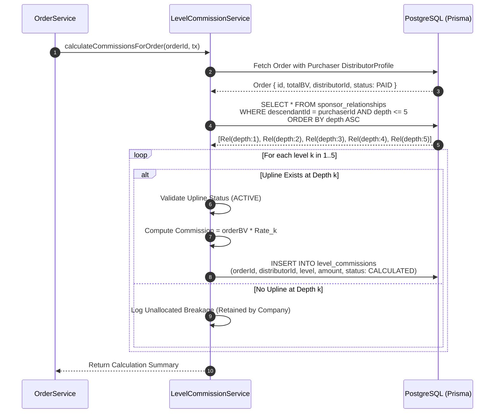
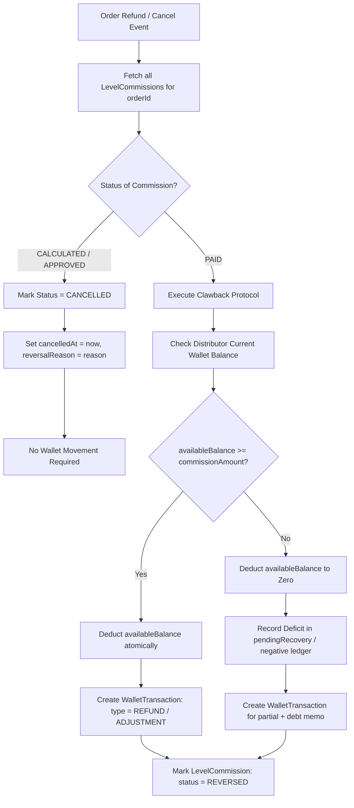
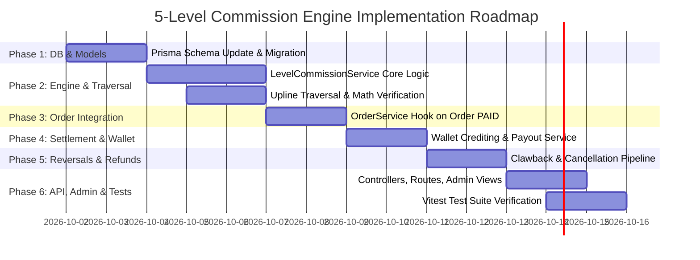

# 5-Level Unilevel Commission System — Architectural Analysis & Implementation Plan

> **Document Type:** Production Architecture, Technical Specification & Engineering Plan  
> **Target Platform:** Kashvi MLM Enterprise Network Marketing Backend  
> **Status:** Architecture Proposal & Design Review (Pre-Implementation)  
> **Author:** Antigravity AI Engineering Architecture Team  
> **Date:** October 1, 2026  

---

## Table of Contents

1. [Executive Summary & Core Business Invariants](#1-executive-summary--core-business-invariants)
2. [Codebase Inspection & Current State Audit (12 Areas)](#2-codebase-inspection--current-state-audit-12-areas)
   - 2.1 [Member / User Model](#21-member--user-model)
   - 2.2 [Sponsor Relationship (Unilevel Tree)](#22-sponsor-relationship-unilevel-tree)
   - 2.3 [Binary Placement Tree Relationship](#23-binary-placement-tree-relationship)
   - 2.4 [Order Model & Lifecycle](#24-order-model--lifecycle)
   - 2.5 [Product Model & Volume Definitions](#25-product-model--volume-definitions)
   - 2.6 [Business Volume (BV) Implementation](#26-business-volume-bv-implementation)
   - 2.7 [Business Building Volume (BB) Implementation](#27-business-building-volume-bb-implementation)
   - 2.8 [Wallet & Ledger Implementation](#28-wallet--ledger-implementation)
   - 2.9 [Existing Commission Engine Implementation](#29-existing-commission-engine-implementation)
   - 2.10 [Existing Transaction Implementation & ACID Guarantees](#210-existing-transaction-implementation--acid-guarantees)
   - 2.11 [Authentication & Token Security](#211-authentication--token-security)
   - 2.12 [Admin & Role-Based Access Control (RBAC)](#212-admin--role-based-access-control-rbac)
3. [Commission Architecture](#3-commission-architecture)
4. [Database Changes & Schema Evolution](#4-database-changes--schema-evolution)
5. [Service Structure & Module Design](#5-service-structure--module-design)
6. [Commission Calculation Flow](#6-commission-calculation-flow)
7. [Upline Traversal Flow](#7-upline-traversal-flow)
8. [Transaction Flow & Double-Entry Ledger](#8-transaction-flow--double-entry-ledger)
9. [Wallet Flow & Payout Settlement](#9-wallet-flow--payout-settlement)
10. [Refund, Cancellation & Clawback Flow](#10-refund-cancellation--clawback-flow)
11. [Idempotency Strategy](#11-idempotency-strategy)
12. [Concurrency Strategy & Deadlock Prevention](#12-concurrency-strategy--deadlock-prevention)
13. [Security Strategy & Anti-Fraud Architecture](#13-security-strategy--anti-fraud-architecture)
14. [Testing Strategy & Test Matrix](#14-testing-strategy--test-matrix)
15. [Phase-by-Phase Implementation Roadmap](#15-phase-by-phase-implementation-roadmap)

---

## 1. Executive Summary & Core Business Invariants

### 1.1 Purpose
This plan analyzes and designs a production-grade **5-Level Unilevel Commission Engine** within the existing Kashvi MLM backend. The commission engine rewards distributors on product orders generated across their 5-tier personal sponsorship genealogy.

### 1.2 Mandatory Mathematical Invariants

```
┌─────────────────────────────────────────────────────────────────────────────┐
│                       COMMISSION CALCULATION BASE                           │
│                                                                             │
│   BASE = ORDER BUSINESS VOLUME (BV)                                         │
│                                                                             │
│   [STRICT RULE] NEVER CALCULATE ON:                                         │
│   ✖ Selling Price (Wholesale / Retail / MRP)                                │
│   ✖ GST-Inclusive / Tax Amount                                              │
│   ✖ Shipping or Handling Fees                                               │
│   ✖ Business Building Volume (BB) (Used for Rank Qualifications)             │
│   ✖ Binary Matching Volume (Left/Right leg pairs)                           │
└─────────────────────────────────────────────────────────────────────────────┘
```

The system distributes commissions across exactly **5 ascending sponsor generations**:

| Generation / Tier | Definition | Commission Rate | Calculation Formula |
| :--- | :--- | :---: | :--- |
| **Level 1** | Direct Sponsor / Enroller of the purchasing distributor | **24%** | $\text{Order BV} \times 0.24$ |
| **Level 2** | Sponsor's Sponsor (2nd Upline) | **8%** | $\text{Order BV} \times 0.08$ |
| **Level 3** | Third Sponsor (3rd Upline) | **13%** | $\text{Order BV} \times 0.13$ |
| **Level 4** | Fourth Sponsor (4th Upline) | **5%** | $\text{Order BV} \times 0.05$ |
| **Level 5** | Fifth Sponsor (5th Upline) | **4%** | $\text{Order BV} \times 0.04$ |
| **TOTAL** | **Theoretical Maximum Payout** | **54%** | $\text{Order BV} \times 0.54$ |

### 1.3 Core Conceptual Distinctions (Non-Confusion Matrix)

To preserve architectural integrity and avoid functional regressions, the engine strictly maintains four separate MLM concepts:

```
┌───────────────────────────────────────────────────────────────────────────────────────────────────┐
│                                   MLM ARCHITECTURAL QUAD-MODEL                                    │
├──────────────────────────┬──────────────────────────┬─────────────────────────┬───────────────────┤
│ 1. SPONSOR UPLINE        │ 2. BINARY PLACEMENT      │ 3. CAREER RANK SYSTEM   │ 4. VOLUME TYPES   │
├──────────────────────────┼──────────────────────────┼─────────────────────────┼───────────────────┤
│ • Unilevel Lineage       │ • 2-Leg Tree (LEFT/RIGHT)│ • Base                  │ • BV (Commission) │
│ • Level 1 (Direct 24%)   │ • Max 2 children/node    │ • Silver                │ • BB (Rank only)  │
│ • Level 2 (8%)           │ • Spillover downline     │ • Gold                  │ • Left Leg Vol    │
│ • Level 3 (13%)          │ • Leg pair matching      │ • Platinum              │ • Right Leg Vol   │
│ • Level 4 (5%)           │ • Weekly binary cap      │ • Diamond               │ • Matched Volume  │
│ • Level 5 (4%)           │ • Matched 10% commission │ • Ruby                  │                   │
│ • 54% total distribution │                          │ • Career recognition    │                   │
└──────────────────────────┴──────────────────────────┴─────────────────────────┴───────────────────┘
```

1. **Sponsor Levels (1–5)** represent genealogical distance via direct referral lineage (`sponsorId` / `SponsorRelationship`).
2. **Career Ranks (Base, Silver, Gold, Platinum, Diamond, Ruby)** are recognition tiers awarded based on Personal BB and Binary Matching Volume. Rank does not redefine genealogical distance.
3. **Binary Tree Nodes (`MLMNode`)** represent organizational spillover placement (`placementPosition: LEFT | RIGHT`). Downline placement in the binary tree **does not** dictate unilevel commission upline.
4. **Volume Types (BV vs. BB vs. Binary Leg Volume)**:
   - **Business Volume (BV)**: The sole currency for percentage commissions.
   - **Business Building Volume (BB)**: Personal volume for career level advancement (`LevelQualificationService`).
   - **Binary Leg Volume**: Team volume accumulated in `BusinessCenter.leftVolume` / `rightVolume` for binary pair matching.

### 1.4 Non-Replacement Guarantee
This commission module is strictly additive:
- **No changes** to existing binary tree placement rules (`MLMNode`).
- **No changes** to `BBTransaction` or `LevelQualificationService`.
- **No changes** to career rank evaluations (`LevelPromotionService`).
- **No changes** to existing binary matching calculations (`calculateBinaryCommission`).

---

## 2. Codebase Inspection & Current State Audit (12 Areas)

A comprehensive code and schema review was conducted across both `backend/` and `server/`.

### 2.1 Member / User Model
- **`backend/prisma/schema.prisma`**:
  - `User` (lines 280–316): Central auth identity. Contains `id` (UUID), `email`, `passwordHash`, `roleName` (`DISTRIBUTOR`, `ADMIN`, `SUPER_ADMIN`, `CUSTOMER`, `SUPPORT`), `status` (`ACTIVE`, `INACTIVE`, `SUSPENDED`, `BLOCKED`).
  - `DistributorProfile` (lines 333–409): Core distributor record. Holds `distributorId` (e.g., `KV-1001`), `distributorCode` (e.g., `DST-10001`), `sponsorId` (direct sponsor foreign key), `status` (`ACTIVE`, `PENDING`, `SUSPENDED`, `TERMINATED`), `lifetimePV` (cumulative BV), `lifetimeGV` (group BV), `currentRankId`, `currentLevelId`, `currentBB`, `currentMatching`.
- **`server/prisma/schema.prisma`**:
  - `User` (lines 75–93) & `Distributor` (lines 96–139): Holds `memberId` (e.g., `88767139`), `rank`, `currentPsv`, `sponsorId`.
- **Key Insight**: The primary operational backend is `backend/` where `DistributorProfile` serves as the authoritative entity. Both `DistributorProfile.sponsorId` and `DistributorProfile.id` are fully indexed.

### 2.2 Sponsor Relationship (Unilevel Tree)
- **`backend/prisma/schema.prisma`**:
  - Model `SponsorRelationship` (lines 448–464) implements a **transitive closure table**:
    - `ancestorId`: UUID of upline sponsor (`DistributorProfile`).
    - `descendantId`: UUID of downline member (`DistributorProfile`).
    - `depth`: Integer generation distance ($1 = \text{direct}, 2 = \text{sponsor's sponsor}, \dots$).
    - `isDirect`: Boolean flag ($true$ when $\text{depth} = 1$).
    - Unique Constraint: `@@unique([ancestorId, descendantId])`.
    - Indexes: `@@index([ancestorId])`, `@@index([descendantId])`, `@@index([depth])`.
- **Population Logic (`backend/src/services/auth.service.ts` lines 360–385)**:
  - When a distributor is registered, a direct relationship is created at `depth = 1`.
  - All existing ancestors of the sponsor are queried (`where: { descendantId: sponsorId }`) and copied with `depth = ancestor.depth + 1`.
- **Key Insight**: We can query all 5 sponsor levels in a single fast indexed query:
  ```sql
  SELECT * FROM sponsor_relationships 
  WHERE descendant_id = :purchaserId AND depth <= 5 
  ORDER BY depth ASC;
  ```

### 2.3 Binary Placement Tree Relationship
- **`backend/prisma/schema.prisma`**:
  - Model `MLMNode` (lines 500–528) and `BusinessCenter` (lines 467–497).
  - Enforces binary topology: `placementParentId` points to parent `MLMNode`, with `placementPosition` (`LEFT` or `RIGHT`).
  - Constraint: `@@unique([placementParentId, placementPosition])` strictly limits each node to 2 children.
  - Materialized Path: `binaryPath` (e.g., `ROOT/L/R/L`).
- **Key Insight**: The binary tree is topologically completely decoupled from the unilevel sponsor tree. A distributor's unilevel sponsor may be at level 1, while their binary parent could be 10 levels deep due to binary spillover. **The 5-Level Commission must traverse `SponsorRelationship` / `sponsorId`, never `placementParentId`.**

### 2.4 Order Model & Lifecycle
- **`backend/prisma/schema.prisma`**:
  - Model `Order` (lines 770–811) and `OrderItem` (lines 814–831):
    - `orderNumber`: Unique identifier (e.g., `ORD-2026-10001`).
    - `status`: `PENDING`, `PAYMENT_PENDING`, `PAID`, `CONFIRMED`, `PROCESSING`, `SHIPPED`, `DELIVERED`, `CANCELLED`, `REFUNDED`.
    - Monetary amounts: `subtotal`, `taxAmount`, `shippingAmount`, `discountAmount`, `totalAmount`.
    - Volume: `totalBV` (`Decimal(12, 2)`).
    - `paidAt`: Timestamp populated upon successful payment clearance.
- **Service Logic (`backend/src/services/order.service.ts`)**:
  - `createOrder` runs in an atomic `$transaction`:
    1. Validates product stock and locks inventory.
    2. Derives unit price and unit BV authoritatively from `Product` in database (never trusts frontend payload).
    3. Calculates `totalBV = sum(quantity * product.bv)`.
    4. Persists `Order` and `OrderItem`.
    5. Credits personal BV into `BVLedger` and increments `DistributorProfile.lifetimePV`.
    6. Rolls up leg volume through binary ancestors.
    7. On `status === 'PAID'`, triggers `CommissionService.processOrderCommissions(order.id, tx)`.
- **Key Insight**: The 5-level commission calculation hook must bind cleanly into the order lifecycle when an order transitions to `PAID`.

### 2.5 Product Model & Volume Definitions
- **`backend/prisma/schema.prisma`**:
  - Model `Product` (lines 623–659):
    - `wholesalePrice`, `retailPrice`, `distributorPrice`, `mrp`.
    - `bv`: Business Volume (`Decimal(12, 2)`).
- **Key Insight**: Products carry an explicit, separate `bv` field. An item priced at ₹1,500 may have 500 BV. Commissions are computed strictly against 500 BV.

### 2.6 Business Volume (BV) Implementation
- **`backend/prisma/schema.prisma` & `backend/src/services/bv.service.ts`**:
  - Model `BVLedger` (lines 857–889):
    - Append-only immutable volume ledger.
    - Fields: `distributorId`, `businessCenterId`, `sourceType` (`ORDER`, `ORDER_REFUND`, `ADJUSTMENT`, `BONUS`, `REVERSAL`), `sourceId` (order ID), `bv`, `balanceAfter`, `position` (`null` for personal volume, `LEFT` or `RIGHT` for binary legs).
- **Key Insight**: `BVLedger` tracks cumulative business volume per distributor. An order's `totalBV` serves as the authoritative basis for commission payouts.

### 2.7 Business Building Volume (BB) Implementation
- **`backend/prisma/schema.prisma` & `backend/src/services/bb.service.ts`**:
  - Model `BBTransaction` (lines 1574–1594):
    - Represents Personal Business Building Volume generated exclusively by a member's own direct personal orders or verified admin adjustments.
    - Unique constraint: `@@unique([memberId, source, referenceId])`.
    - Balance: `balanceAfter >= 0.00`.
- **Key Insight**: BB is reserved for rank progression (Base $\to$ Ruby) and **must not** be used as the commission calculation basis.

### 2.8 Wallet & Ledger Implementation
- **`backend/prisma/schema.prisma` & `backend/src/services/wallet.service.ts`**:
  - Model `Wallet` (lines 1013–1036):
    - `availableBalance`, `pendingBalance`, `lifetimeEarned`, `lifetimePaid`, `currency`, `isLocked`.
  - Model `WalletTransaction` (lines 1039–1062):
    - `walletId`, `transactionNumber` (unique), `type` (`COMMISSION`, `WITHDRAWAL`, `TRANSFER`, `REFUND`, `ADJUSTMENT`), `status` (`COMPLETED`, `PENDING`, `REVERSED`), `amount`, `balanceBefore`, `balanceAfter`, `referenceId`.
  - Method `WalletService.processPayableCommissions(options, client)`:
    - Finds eligible commissions in `CALCULATED` or `APPROVED` status.
    - Atomically updates `Wallet.availableBalance` and `lifetimeEarned`.
    - Inserts `WalletTransaction` with `type: COMMISSION`.
    - Marks commission as `PAID`.
- **Key Insight**: The existing design enforces the rule: *Create commission ledger records first during order processing; wallet balance is only credited during payout or approved settlement.*

### 2.9 Existing Commission Engine Implementation
- **`backend/src/services/commission.service.ts`**:
  - Model `Commission` (lines 951–985) has `businessReference` unique constraint for idempotency.
  - Types in `CommissionRuleType`: `BASE`, `PC_ORDER`, `MILESTONE`, `FRONTLINE`, `BINARY`, `RANK`.
  - States in `CommissionStatus`: `CALCULATED`, `PENDING_REVIEW`, `APPROVED`, `PAID`, `CANCELLED`, `REVERSED`.
- **Key Insight**: We should add `UNILEVEL_LEVEL` (or `LEVEL_COMMISSION`) to the commission rule architecture, or create a specialized, dedicated `LevelCommission` table to maintain zero-bloat query isolation.

### 2.10 Existing Transaction Implementation & ACID Guarantees
- Prisma `$transaction(async (tx) => { ... }, { timeout: 15000 })` is standard across `OrderService`, `BVService`, and `WalletService`.
- All ledger tables (`BVLedger`, `BBTransaction`, `MatchingTransaction`, `WalletTransaction`) compute `balanceAfter` strictly inside transactions and use unique compound constraints for deduplication.

### 2.11 Authentication & Token Security
- Handled by `backend/src/middleware/auth.ts`:
  - Validates `Bearer` JWT tokens with `jsonwebtoken`.
  - Injects `req.user = { id, email, role, status }`.
  - Rejects blocked or suspended accounts (`403 Forbidden`).

### 2.12 Admin & Role-Based Access Control (RBAC)
- Handled by `backend/src/middleware/role.ts`:
  - `authorizeRoles('ADMIN', 'SUPER_ADMIN')` guards financial, configuration, and manual adjustment endpoints.
  - Audit logs are written to `AuditLog` table for compliance.

---

## 3. Commission Architecture

### 3.1 End-to-End Pipeline Overview

```mermaid
flowchart TD
    subgraph OrderStage["1. Order Stage"]
        A[Customer / Distributor Places Order] --> B[Order Created: status = PAID]
        B --> C[Derive Authoritative totalBV from Products]
        C --> D[Append Personal BVLedger Entry]
    end

    subgraph TraversalStage["2. Upline Traversal Stage"]
        D --> E[Resolve Purchaser Distributor Profile]
        E --> F[Query 5-Level Sponsor Genealogy<br/>via SponsorRelationship & sponsorId]
        F --> G[Extract Upline Chain:<br/>Level 1, Level 2, Level 3, Level 4, Level 5]
    end

    subgraph CalculationStage["3. Calculation & Qualification Stage"]
        G --> H1[Level 1: 24% of BV]
        G --> H2[Level 2: 8% of BV]
        G --> H3[Level 3: 13% of BV]
        G --> H4[Level 4: 5% of BV]
        G --> H5[Level 5: 4% of BV]
        H1 & H2 & H3 & H4 & H5 --> I[Verify Distributor Active Status & Eligibility]
    end

    subgraph LedgerStage["4. Immutable Commission Ledger Stage"]
        I --> J[Generate Unique Idempotency Key:<br/>LEVEL:{orderId}:L{k}:{distributorId}]
        J --> K[Insert LevelCommission Record<br/>status = CALCULATED]
    end

    subgraph SettlementStage["5. Settlement & Wallet Stage"]
        K --> L{Payout Trigger:<br/>Real-Time or Cycle Batch}
        L -->|Approve & Pay| M[Begin Prisma Atomic Transaction]
        M --> N[Increment Wallet availableBalance & lifetimeEarned]
        N --> O[Append WalletTransaction: type = COMMISSION]
        O --> P[Update LevelCommission: status = PAID]
    end
```

### 3.2 Component Decoupling
1. **Order Processing Hook**: `OrderService` triggers `LevelCommissionService.calculateForOrder(orderId, tx)` inside the payment completion transaction.
2. **Dedicated Commission Domain**: `LevelCommissionService` executes isolated from binary tree and career rank logic.
3. **Double-Entry Ledgers**:
   - `level_commissions` tracks who earned what from which order, at which generation level, and what BV base was used.
   - `wallet_transactions` tracks cash movements into the distributor's wallet.
4. **Zero Impact on Binary Matching**: Binary pairing calculations read from `BVLedger` leg volume independently. The 5-level unilevel payout does not reduce or inflate binary leg volume.

---

## 4. Database Changes & Schema Evolution

### 4.1 Schema Evaluation: Dedicated Model vs. General Commission Model

| Criterion | Extending Existing `Commission` Table | Dedicated `LevelCommission` Table |
| :--- | :--- | :--- |
| **Schema Normalization** | Mixed binary matching fields with unilevel fields (nullable columns). | Clean, 100% non-null fields specific to unilevel rates and levels. |
| **Query Performance** | Index bloat as table scales with high-frequency matching records. | Focused indexes on `[orderId]`, `[distributorId]`, and `[level]`. |
| **Audit Clarity** | Requires inspecting `type` and `details` JSON to parse unilevel data. | Explicit columns: `level`, `orderBV`, `ratePercentage`, `commissionAmount`. |
| **Existing System Safety** | Risk of mutating existing queries filtering on `Commission`. | **Zero risk** to existing binary matching or rank bonus logic. |

**Architectural Decision:** Implement a dedicated **`LevelCommission`** table in `backend/prisma/schema.prisma` alongside an addition to `CommissionRuleType` (`LEVEL_COMMISSION`) for global configuration.

### 4.2 Proposed Prisma Schema Additions

```prisma
// ==========================================
// 5-LEVEL UNILEVEL COMMISSION SCHEMA
// ==========================================

enum LevelCommissionStatus {
  CALCULATED
  APPROVED
  PAID
  CANCELLED
  REVERSED
  FORFEITED
}

model LevelCommission {
  id                    String                @id @default(uuid())
  commissionNumber      String                @unique // e.g., LCM-2026-10001
  businessReference     String                @unique // Idempotency: "LEVEL:{orderId}:L{level}:{distributorId}"
  
  orderId               String
  distributorId         String                // Beneficiary: Upline distributor earning the commission
  sourceDistributorId   String                // Originator: Downline member who placed the order
  
  level                 Int                   // 1, 2, 3, 4, 5
  ratePercentage        Decimal               @db.Decimal(5, 2)  // 24.00, 8.00, 13.00, 5.00, 4.00
  orderBV               Decimal               @db.Decimal(12, 2) // Base BV of the order
  commissionAmount      Decimal               @db.Decimal(12, 2) // (orderBV * ratePercentage) / 100
  
  status                LevelCommissionStatus @default(CALCULATED)
  currency              String                @default("INR") // Configurable, default INR/USD
  
  periodId              String?               // Optional link to CommissionPeriod
  walletTransactionId   String?               @unique // Populated upon wallet credit
  
  calculationDetails    Json?                 // Detailed breakdown snapshot
  paidAt                DateTime?
  cancelledAt           DateTime?
  reversalReason        String?
  
  createdAt             DateTime              @default(now())
  updatedAt             DateTime              @updatedAt

  // Relationships
  order                 Order                 @relation("OrderLevelCommissions", fields: [orderId], references: [id], onDelete: Cascade)
  distributor           DistributorProfile    @relation("UplineLevelCommissions", fields: [distributorId], references: [id], onDelete: Cascade)
  sourceDistributor     DistributorProfile    @relation("SourceMemberLevelCommissions", fields: [sourceDistributorId], references: [id], onDelete: Cascade)
  period                CommissionPeriod?     @relation("PeriodLevelCommissions", fields: [periodId], references: [id])
  walletTransaction     WalletTransaction?    @relation("LevelCommissionWalletTx", fields: [walletTransactionId], references: [id])

  // Strict Compound Constraints & Indexes
  @@unique([orderId, level])                           // Exactly ONE commission per level per order
  @@index([distributorId, status])                     // Fast lookup for distributor dashboard & payouts
  @@index([sourceDistributorId])                       // Order origin tracking
  @@index([orderId])                                   // Order refund / cancellation lookup
  @@index([level])                                     // Analytics by level
  @@index([status])                                    // Bulk payout processing
  @@index([createdAt])                                 // Date filtering
  @@map("level_commissions")
}
```

### 4.3 Updates to Existing Models
1. **`Order` Model**:
   ```prisma
   levelCommissions LevelCommission[] @relation("OrderLevelCommissions")
   ```
2. **`DistributorProfile` Model**:
   ```prisma
   earnedLevelCommissions LevelCommission[] @relation("UplineLevelCommissions")
   sourceLevelCommissions LevelCommission[] @relation("SourceMemberLevelCommissions")
   ```
3. **`CommissionPeriod` Model**:
   ```prisma
   levelCommissions LevelCommission[] @relation("PeriodLevelCommissions")
   ```
4. **`WalletTransaction` Model**:
   ```prisma
   levelCommission LevelCommission? @relation("LevelCommissionWalletTx")
   ```
5. **`CommissionRuleType` Enum**:
   ```prisma
   enum CommissionRuleType {
     BASE
     PC_ORDER
     MILESTONE
     FRONTLINE
     BINARY
     RANK
     LEVEL_COMMISSION // Add new enum value
   }
   ```

### 4.4 PostgreSQL Raw Migration DDL

```sql
-- CreateEnum
CREATE TYPE "LevelCommissionStatus" AS ENUM ('CALCULATED', 'APPROVED', 'PAID', 'CANCELLED', 'REVERSED', 'FORFEITED');

-- AlterEnum
ALTER TYPE "CommissionRuleType" ADD VALUE IF NOT EXISTS 'LEVEL_COMMISSION';

-- CreateTable
CREATE TABLE "level_commissions" (
    "id" TEXT NOT NULL,
    "commissionNumber" TEXT NOT NULL,
    "businessReference" TEXT NOT NULL,
    "orderId" TEXT NOT NULL,
    "distributorId" TEXT NOT NULL,
    "sourceDistributorId" TEXT NOT NULL,
    "level" INTEGER NOT NULL,
    "ratePercentage" DECIMAL(5,2) NOT NULL,
    "orderBV" DECIMAL(12,2) NOT NULL,
    "commissionAmount" DECIMAL(12,2) NOT NULL,
    "status" "LevelCommissionStatus" NOT NULL DEFAULT 'CALCULATED',
    "currency" TEXT NOT NULL DEFAULT 'INR',
    "periodId" TEXT,
    "walletTransactionId" TEXT,
    "calculationDetails" JSONB,
    "paidAt" TIMESTAMP(3),
    "cancelledAt" TIMESTAMP(3),
    "reversalReason" TEXT,
    "createdAt" TIMESTAMP(3) NOT NULL DEFAULT CURRENT_TIMESTAMP,
    "updatedAt" TIMESTAMP(3) NOT NULL,

    CONSTRAINT "level_commissions_pkey" PRIMARY KEY ("id")
);

-- Unique constraints
CREATE UNIQUE INDEX "level_commissions_commissionNumber_key" ON "level_commissions"("commissionNumber");
CREATE UNIQUE INDEX "level_commissions_businessReference_key" ON "level_commissions"("businessReference");
CREATE UNIQUE INDEX "level_commissions_orderId_level_key" ON "level_commissions"("orderId", "level");
CREATE UNIQUE INDEX "level_commissions_walletTransactionId_key" ON "level_commissions"("walletTransactionId");

-- Performance indexes
CREATE INDEX "level_commissions_distributorId_status_idx" ON "level_commissions"("distributorId", "status");
CREATE INDEX "level_commissions_sourceDistributorId_idx" ON "level_commissions"("sourceDistributorId");
CREATE INDEX "level_commissions_orderId_idx" ON "level_commissions"("orderId");
CREATE INDEX "level_commissions_level_idx" ON "level_commissions"("level");
CREATE INDEX "level_commissions_status_idx" ON "level_commissions"("status");
CREATE INDEX "level_commissions_createdAt_idx" ON "level_commissions"("createdAt");

-- Foreign key constraints
ALTER TABLE "level_commissions" ADD CONSTRAINT "level_commissions_orderId_fkey" FOREIGN KEY ("orderId") REFERENCES "orders"("id") ON DELETE CASCADE ON UPDATE CASCADE;
ALTER TABLE "level_commissions" ADD CONSTRAINT "level_commissions_distributorId_fkey" FOREIGN KEY ("distributorId") REFERENCES "distributor_profiles"("id") ON DELETE CASCADE ON UPDATE CASCADE;
ALTER TABLE "level_commissions" ADD CONSTRAINT "level_commissions_sourceDistributorId_fkey" FOREIGN KEY ("sourceDistributorId") REFERENCES "distributor_profiles"("id") ON DELETE CASCADE ON UPDATE CASCADE;
ALTER TABLE "level_commissions" ADD CONSTRAINT "level_commissions_periodId_fkey" FOREIGN KEY ("periodId") REFERENCES "commission_periods"("id") ON DELETE SET NULL ON UPDATE CASCADE;
ALTER TABLE "level_commissions" ADD CONSTRAINT "level_commissions_walletTransactionId_fkey" FOREIGN KEY ("walletTransactionId") REFERENCES "wallet_transactions"("id") ON DELETE SET NULL ON UPDATE CASCADE;
```

---

## 5. Service Structure & Module Design

### 5.1 Directory Organization

The new commission domain will be housed cleanly under `backend/src/services/` with its own controller, route, and validator files:

```
backend/src/
├── services/
│   ├── levelCommission.service.ts       <-- Primary 5-level commission engine
│   ├── sponsor.service.ts               <-- Upline lineage validation
│   ├── order.service.ts                 <-- Integrates commission trigger on PAID
│   ├── wallet.service.ts                <-- Processes approved payouts
│   └── bv.service.ts                    <-- Authoritative BV reference
├── controllers/
│   └── levelCommission.controller.ts    <-- REST endpoints for members & admins
├── routes/
│   └── levelCommission.routes.ts        <-- Protected API routes
├── validators/
│   └── levelCommission.validators.ts    <-- Zod validation schemas
└── types/
    └── levelCommission.types.ts         <-- Type definitions and DTOs
```

### 5.2 TypeScript Interfaces (`backend/src/types/levelCommission.types.ts`)

```typescript
export interface CommissionLevelRate {
  level: number;
  ratePercentage: number; // 24, 8, 13, 5, 4
}

export const CANONICAL_LEVEL_RATES: readonly CommissionLevelRate[] = Object.freeze([
  { level: 1, ratePercentage: 24.0 },
  { level: 2, ratePercentage: 8.0 },
  { level: 3, ratePercentage: 13.0 },
  { level: 4, ratePercentage: 5.0 },
  { level: 5, ratePercentage: 4.0 },
]);

export const TOTAL_THEORETICAL_DISTRIBUTION_PERCENT = 54.0;

export interface UplineSponsorNode {
  level: number;
  distributorId: string;
  distributorCode: string;
  displayName: string;
  status: string; // ACTIVE, INACTIVE, SUSPENDED
  isDirect: boolean;
}

export interface CalculateOrderLevelCommissionResult {
  orderId: string;
  orderNumber: string;
  orderBV: number;
  totalDistributedPercentage: number;
  totalCommissionAmount: number;
  commissions: Array<{
    id: string;
    level: number;
    beneficiaryId: string;
    beneficiaryCode: string;
    beneficiaryName: string;
    ratePercentage: number;
    commissionAmount: number;
    status: string;
    businessReference: string;
  }>;
  skippedLevels: Array<{
    level: number;
    ratePercentage: number;
    reason: 'NO_UPLINE_EXISTS' | 'UPLINE_INACTIVE' | 'ZERO_BV';
  }>;
}

export interface ReverseCommissionResult {
  orderId: string;
  reversedCount: number;
  totalReversedAmount: number;
  walletDeductions: Array<{
    distributorId: string;
    amount: number;
    walletTransactionId?: string;
  }>;
}
```

### 5.3 Service API Contracts (`LevelCommissionService`)

```typescript
export class LevelCommissionService {
  /**
   * Traverses sponsor upline up to 5 generations for a given distributor.
   */
  public static async getSponsorUpline5Levels(
    distributorId: string,
    tx?: Prisma.TransactionClient
  ): Promise<UplineSponsorNode[]>;

  /**
   * Idempotently calculates and logs 5-level commissions for a qualified PAID order.
   */
  public static async calculateCommissionsForOrder(
    orderId: string,
    tx?: Prisma.TransactionClient
  ): Promise<CalculateOrderLevelCommissionResult>;

  /**
   * Previews commission payout amounts without committing to database.
   */
  public static async previewOrderCommissions(
    orderBV: number,
    purchaserDistributorId: string
  ): Promise<CalculateOrderLevelCommissionResult>;

  /**
   * Settles / pays calculated commissions into distributor wallets.
   */
  public static async payoutLevelCommissions(
    options: {
      orderId?: string;
      distributorId?: string;
      commissionIds?: string[];
      periodId?: string;
    },
    tx?: Prisma.TransactionClient
  ): Promise<{ paidCount: number; totalPaidAmount: number; transactionIds: string[] }>;

  /**
   * Reverses commissions upon order refund or cancellation.
   */
  public static async reverseCommissionsForOrder(
    orderId: string,
    reason: string,
    tx?: Prisma.TransactionClient
  ): Promise<ReverseCommissionResult>;

  /**
   * Retrieves paginated commission earnings for a distributor dashboard.
   */
  public static async getDistributorLevelCommissions(
    distributorId: string,
    query: { page?: number; limit?: number; level?: number; status?: string }
  ): Promise<any>;
}
```

---

## 6. Commission Calculation Flow

### 6.1 Mathematical Formulation

For an order $\mathcal{O}$ with verified Business Volume $\text{BV}_\mathcal{O} > 0$:

1. Base is exclusively the order BV:
   $$\text{Base} = \text{BV}_\mathcal{O} = \sum_{i \in \text{Items}} (\text{quantity}_i \times \text{unitBV}_i)$$
2. For each level $k \in \{1, 2, 3, 4, 5\}$:
   $$\text{Rate}_k = \begin{cases} 
   0.24 & (k = 1) \\ 
   0.08 & (k = 2) \\ 
   0.13 & (k = 3) \\ 
   0.05 & (k = 4) \\ 
   0.04 & (k = 5) 
   \end{cases}$$
3. Gross Commission for level $k$:
   $$\mathcal{C}_k = \text{round}\left(\text{Base} \times \text{Rate}_k, 2\right)$$
4. Theoretical Maximum Distribution Check:
   $$\sum_{k=1}^5 \text{Rate}_k = 24\% + 8\% + 13\% + 5\% + 4\% = 54\%$$
   $$\sum_{k=1}^5 \mathcal{C}_k \approx \text{Base} \times 0.54$$

### 6.2 Worked Examples

#### Example A: 1,000 BV Order (e.g., ₹2,500 Product Purchase)
- **Base BV:** 1,000.00
- **Level 1 (Direct Sponsor):** $1,000 \times 24\% = \text{₹}240.00$
- **Level 2 (Sponsor's Sponsor):** $1,000 \times 8\% = \text{₹}80.00$
- **Level 3 (3rd Upline):** $1,000 \times 13\% = \text{₹}130.00$
- **Level 4 (4th Upline):** $1,000 \times 5\% = \text{₹}50.00$
- **Level 5 (5th Upline):** $1,000 \times 4\% = \text{₹}40.00$
- **Total Paid Out:** $\text{₹}540.00$ ($54.00\%$ of BV).

#### Example B: 250 BV Order (e.g., ₹750 Starter Kit)
- **Base BV:** 250.00
- **Level 1 (Direct Sponsor):** $250 \times 24\% = \text{₹}60.00$
- **Level 2 (Sponsor's Sponsor):** $250 \times 8\% = \text{₹}20.00$
- **Level 3 (3rd Upline):** $250 \times 13\% = \text{₹}32.50$
- **Level 4 (4th Upline):** $250 \times 5\% = \text{₹}12.50$
- **Level 5 (5th Upline):** $250 \times 4\% = \text{₹}10.00$
- **Total Paid Out:** $\text{₹}135.00$ ($54.00\%$ of BV).

#### Example C: Truncated Upline (Distributor has only 2 Uplines before Company Root)
- **Base BV:** 1,000.00
- **Level 1:** Evaluated $\to$ ₹240.00 paid to Direct Sponsor.
- **Level 2:** Evaluated $\to$ ₹80.00 paid to 2nd Upline.
- **Level 3:** No upline exists $\to$ Marked `NO_UPLINE_EXISTS`, ₹130.00 retained by Company.
- **Level 4:** No upline exists $\to$ Marked `NO_UPLINE_EXISTS`, ₹50.00 retained by Company.
- **Level 5:** No upline exists $\to$ Marked `NO_UPLINE_EXISTS`, ₹40.00 retained by Company.
- **Total Distributed:** ₹320.00. Unallocated ₹220.00 stays in company operating margin.

---

## 7. Upline Traversal Flow

### 7.1 Hybrid Traversal Algorithm

To guarantee high speed and fault tolerance, the engine employs a **hybrid traversal strategy**:
1. **Primary Query**: Read from the indexed `SponsorRelationship` closure table where `descendantId = :purchaserId AND depth <= 5`.
2. **Integrity Validation / Fallback**: Verify against direct parent pointer `DistributorProfile.sponsorId`.



### 7.2 Cycle Detection & Safeguards
- **Maximum Depth Invariant**: The query strictly filters `depth <= 5`. Even in malformed legacy structures, traversal never exceeds 5 iterations.
- **Self-Sponsorship Prevention**: If `ancestorId === descendantId`, the record is immediately dropped and flagged to compliance.
- **Inactive / Suspended Distributors**:
  - If a distributor at level $k$ has `status !== 'ACTIVE'`, their commission is marked `FORFEITED` (or passes to company retention). Optional dynamic compression can be toggled via `SystemSetting`.

---

## 8. Transaction Flow & Double-Entry Ledger

All operations follow **double-entry, immutable ledger accounting**:

```
                       ┌──────────────────────────────────────────────┐
                       │           Order Paid Event (PAID)            │
                       └──────────────────────┬───────────────────────┘
                                              │
                      ┌───────────────────────┴───────────────────────┐
                      ▼                                               ▼
        ┌───────────────────────────┐                   ┌───────────────────────────┐
        │         BVLedger          │                   │      LevelCommission      │
        │    (Volume Accounting)    │                   │   (Payable Obligation)    │
        ├───────────────────────────┤                   ├───────────────────────────┤
        │ • sourceType = ORDER      │                   │ • status = CALCULATED     │
        │ • bv = orderTotalBV       │                   │ • rate = 24%, 8%, ...     │
        │ • balanceAfter calculated │                   │ • amount = orderBV * rate │
        │ • position = null         │                   │ • orderId, uplineId, lvl  │
        └───────────────────────────┘                   └─────────────┬─────────────┘
                                                                      │
                                                   [Admin / Payout Batch Trigger]
                                                                      ▼
                                                        ┌───────────────────────────┐
                                                        │     WalletTransaction     │
                                                        │     (Disbursement)        │
                                                        ├───────────────────────────┤
                                                        │ • type = COMMISSION       │
                                                        │ • amount = comm.amount    │
                                                        │ • balanceAfter updated    │
                                                        │ • referenceId = comm.id   │
                                                        └─────────────┬─────────────┘
                                                                      │
                                                                      ▼
                                                        ┌───────────────────────────┐
                                                        │          Wallet           │
                                                        │   availableBalance += amt │
                                                        │   lifetimeEarned += amt   │
                                                        └───────────────────────────┘
```

---

## 9. Wallet Flow & Payout Settlement

### 9.1 Separation of Calculation and Disbursement
1. **Order Checkout**: Generates `LevelCommission` rows with `status = CALCULATED`. The wallet balance is **not** immediately touched. This protects the company from paying out commissions on orders that could be cancelled within 15 minutes.
2. **Settlement / Payout**:
   - Commissions enter `APPROVED` status after passing the order grace period (e.g., 24 hours or return window).
   - `LevelCommissionService.payoutLevelCommissions` moves them to `PAID` and issues a `WalletTransaction` atomically.

### 9.2 Atomic Wallet Crediting Algorithm
```typescript
await tx.$transaction(async (client) => {
  // 1. Lock wallet row for update to prevent concurrent race condition
  const wallet = await client.wallet.findUnique({
    where: { distributorId },
  });

  const balanceBefore = wallet.availableBalance;
  const balanceAfter = balanceBefore.add(commission.commissionAmount);

  // 2. Append immutable WalletTransaction
  const walletTx = await client.walletTransaction.create({
    data: {
      walletId: wallet.id,
      transactionNumber: `WTX-${Date.now()}-${Math.floor(1000 + Math.random() * 9000)}`,
      type: 'COMMISSION',
      status: 'COMPLETED',
      amount: commission.commissionAmount,
      balanceBefore,
      balanceAfter,
      referenceId: commission.id,
      description: `Level ${commission.level} Unilevel Commission from Order ${order.orderNumber}`,
    },
  });

  // 3. Increment balances on Wallet
  await client.wallet.update({
    where: { id: wallet.id },
    data: {
      availableBalance: balanceAfter,
      lifetimeEarned: { increment: commission.commissionAmount },
    },
  });

  // 4. Mark Commission as PAID
  await client.levelCommission.update({
    where: { id: commission.id },
    data: {
      status: 'PAID',
      paidAt: new Date(),
      walletTransactionId: walletTx.id,
    },
  });
});
```

---

## 10. Refund, Cancellation & Clawback Flow

When an order is cancelled, returned, or disputed, commissions distributed for that order must be reversed without corrupting the financial ledger.



### 10.1 Clawback Rules
1. **Never delete records**: `LevelCommission` records are transitioned to `CANCELLED` or `REVERSED`.
2. **Audit Logging**: Every clawback writes to `AuditLog` capturing admin ID or system event, refunded amount, and order ID.
3. **Volume Synchronization**: Concurrently calls `BVService.debitBV` with `sourceType = ORDER_REFUND` to deduct personal BV from the purchaser.

---

## 11. Idempotency Strategy

In high-volume e-commerce, payment gateways may send repeated webhooks or operators may retry order payment confirmations. The system implements multi-layered idempotency.

### 11.1 Idempotency Key Structure
Every level commission generates a deterministic **business reference**:
```
LEVEL:{orderId}:L{level}:{distributorId}
```
*Example:* `LEVEL:ord-9821-ab:L1:dst-10001`

### 11.2 Database Constraints
```prisma
@@unique([businessReference])
@@unique([orderId, level])
```
- **Guaranteed Singularity**: The database physically prohibits inserting two commissions for Level 1 on the same order.
- **Graceful Re-entrancy**: If `calculateCommissionsForOrder` is called twice for the same order, the second call detects existing rows via `findUnique` and returns the existing records without error or duplication.

---

## 12. Concurrency Strategy & Deadlock Prevention

### 12.1 Deadlock Vulnerability Analysis
When multiple orders occur simultaneously under downline members that share the same upline distributors (e.g. flash sales), multiple threads might attempt to lock the same upline wallet rows in different orders, creating PostgreSQL deadlocks.

### 12.2 Deadlock Prevention Protocol
1. **Asynchronous Ledger vs. Synchronous Order**:
   - Order creation inserts `LevelCommission` in `CALCULATED` status. This touches only newly inserted rows in `level_commissions`, avoiding locks on existing wallet rows.
2. **Ordered Wallet Locking During Payout**:
   - When paying out commissions across multiple distributors, sort all target distributor IDs lexicographically before acquiring locks:
     ```typescript
     const sortedDistributorIds = [...new Set(distributorIds)].sort();
     for (const distId of sortedDistributorIds) {
       // Lock and process wallet in strict deterministic sequence
     }
     ```
3. **Optimistic Locking**:
   - Wallets use Prisma atomic increment operations (`availableBalance: { increment: amount }`) to allow high-throughput non-blocking updates.

---

## 13. Security Strategy & Anti-Fraud Architecture

1. **Server-Side Authoritative BV**:
   - Client applications cannot supply `unitBV` or `orderBV`. Prices and volume points are read strictly from `Product` records within the transaction.
2. **Circular Lineage Interceptors**:
   - `SponsorRelationship` checks prevent any account from sponsoring an ancestor, eliminating endless recursive commission loops.
3. **Role-Based Protection on Recalculation Endpoints**:
   - Manual commission recalculation or adjustment endpoints require `SUPER_ADMIN` or `ADMIN` clearance (`authorizeRoles('ADMIN', 'SUPER_ADMIN')`).
4. **Data Masking in Public APIs**:
   - Member responses expose only non-sensitive distributor codes and public display names. Internal UUIDs, phone numbers, and bank details are masked (`masking.ts`).
5. **Tamper-Evident Ledger Invariants**:
   - Balance after every transaction must equal $\text{balanceBefore} + \text{netAmount}$. Periodic reconciliation jobs (`mlmReconciliation.service.ts`) verify mathematical integrity across `level_commissions` and `wallet_transactions`.

---

## 14. Testing Strategy & Test Matrix

A comprehensive Vitest test suite will be created at `backend/tests/levelCommission.test.ts`.

### 14.1 Unit Test Matrix
| Test Case ID | Test Description | Expected Result |
| :--- | :--- | :--- |
| **TC-LCM-01** | Exact percentage calculation on 1,000 BV | L1 = ₹240, L2 = ₹80, L3 = ₹130, L4 = ₹50, L5 = ₹40. Total = ₹540 (54%). |
| **TC-LCM-02** | Exact percentage calculation on fractional BV (e.g. 333.33 BV) | Accurate 2-decimal rounded splits summing to 54% within ±0.01 tolerance. |
| **TC-LCM-03** | Order with Zero BV (0.00 BV) | Zero commissions created, skipped cleanly. |
| **TC-LCM-04** | Hierarchy with exactly 5 active levels | All 5 uplines receive exact designated tier percentages. |
| **TC-LCM-05** | Short hierarchy (Purchaser is direct child of Root, only 1 upline) | Level 1 receives 24%. Levels 2–5 recorded as unallocated/retained by company. |
| **TC-LCM-06** | Intermediate Inactive Upline (e.g., Level 2 is INACTIVE) | Level 2 skipped or marked FORFEITED; Level 3 still receives exact 13%. |
| **TC-LCM-07** | Idempotency on repeated calculation calls | Second run returns existing records; zero duplicate database rows created. |
| **TC-LCM-08** | Order cancellation before payout | All CALCULATED records transition to CANCELLED; no wallet transactions created. |
| **TC-LCM-09** | Order refund after payout | Reversal creates debit WalletTransaction and marks commission REVERSED. |
| **TC-LCM-10** | Non-confusion with Career Ranks | Level 1 sponsor with Ruby rank receives 24%; Level 1 sponsor with Base rank receives 24%. |

### 14.2 Integration Test Flow
1. Seed test genealogy: Member A $\to$ Member B $\to$ Member C $\to$ Member D $\to$ Member E $\to$ Member F.
2. Member F places order for ₹5,000 with 2,000 BV.
3. Verify `Order` marked `PAID`.
4. Assert 5 `LevelCommission` records created:
   - Member E (Level 1): ₹480.00 (24%)
   - Member D (Level 2): ₹160.00 (8%)
   - Member C (Level 3): ₹260.00 (13%)
   - Member B (Level 4): ₹100.00 (5%)
   - Member A (Level 5): ₹80.00 (4%)
5. Run payout process $\to$ Assert wallet balances incremented by exact amounts.

---

## 15. Phase-by-Phase Implementation Roadmap



### Next Steps for Review
1. Review this document against business rules and architecture standards.
2. Confirm unallocated upline breakage policy (Company Treasury retention vs Dynamic Compression).
3. Upon approval, proceed to **Phase 1: Database Migration & Model Definitions**.
