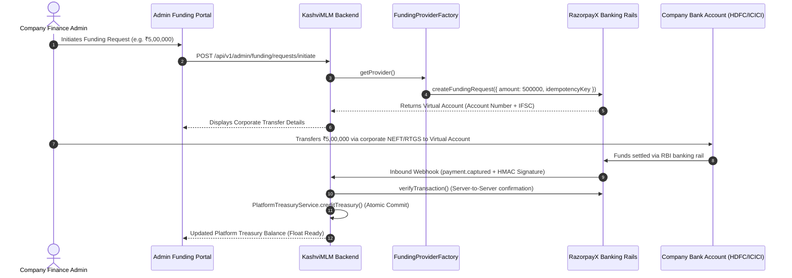

# KashviMLM — Regulated Funding & Banking Provider Setup Guide

> **Document Version**: 1.0.0  
> **Target Module**: `src/providers/funding/`  
> **Selected Regulated Provider**: **RazorpayX (Corporate Banking & Smart Collect)**  
> **Fallback/Sandbox Provider**: `MockFundingProvider` (Automated CI / Local Sandbox)

---

## 1. Architectural Philosophy: Zero-Credential Integration

In accordance with strict financial regulations (RBI, PCI-DSS, ISO 27001) and platform security standards:
- **NO Custom Bank Logins**: The platform **never** performs web scraping, screen recording, or simulated user logins to corporate net banking.
- **NEVER Store Credentials**: The platform **strictly forbids** requesting, storing, or processing:
  - Bank account passwords
  - Transaction PINs
  - One-Time Passwords (OTPs)
  - Debit/Credit card CVVs
  - Internet banking credentials
- **Tokenized API Communication**: All banking and payout operations communicate strictly through **regulated API endpoints** using cryptographically signed tokens and API keys over TLS 1.3.

---

## 2. Pluggable Architecture Overview

The funding integration uses a **pluggable, replaceable provider architecture** located in [`src/providers/funding/`](file:///C:/Users/msila/Downloads/kashvimlm-main%20%281%29/kashvimlm-main/backend/src/providers/funding/):

```text
src/providers/funding/
├── index.ts                      # Clean barrel export of all funding interfaces & classes
├── fundingProvider.interface.ts  # Standard IFundingProvider contract and DTOs
├── fundingProvider.factory.ts    # Dynamic provider resolution via environment configuration
├── mockFundingProvider.ts        # In-memory sandbox provider for tests and development
└── razorpayXFundingProvider.ts   # Production RazorpayX Smart Collect & Banking integration
```

### The `IFundingProvider` Contract

Any provider implemented in this system conforms to the following methods:

| Method | Description |
| :--- | :--- |
| **`connectAccount()`** | Registers the company's verified corporate account using tokenized identifiers. |
| **`disconnectAccount()`** | Safely unbinds an account from active operations. |
| **`getAccountStatus()`** | Queries account verification state, health, and current provider float. |
| **`createFundingRequest()`** | Generates a funding order / Virtual Account for inward corporate funds. |
| **`getFundingStatus()`** | Queries the real-time settlement status of a funding transaction. |
| **`verifyTransaction()`** | Performs authoritative server-to-server amount and UTR verification. |
| **`handleWebhook()`** | Validates HMAC-SHA256 signatures with timing-safe comparison. |
| **`reconcileTransaction()`** | Reconciles settled bank statement lines against expected ledger entries. |

---

## 3. Environment Configuration

All provider credentials and secrets **must be loaded exclusively from environment variables**. Never commit API keys, secrets, or account numbers to version control.

### Required Environment Variables

Add the following to your `.env` file:

```env
# ==============================================================================
# CORPORATE FUNDING & BANKING PROVIDER CONFIGURATION
# ==============================================================================

# Active Provider Selection: 'MOCK' (dev/testing) or 'RAZORPAYX' (production)
FUNDING_PROVIDER=MOCK

# RazorpayX API Credentials (Generated from RazorpayX Dashboard -> Settings -> API Keys)
FUNDING_PROVIDER_KEY_ID=rzp_live_your_key_id_here
FUNDING_PROVIDER_KEY_SECRET=your_key_secret_keep_secret_here

# Webhook Secret for HMAC-SHA256 Signature Verification
FUNDING_PROVIDER_WEBHOOK_SECRET=your_webhook_secret_min_32_characters_here

# Corporate Current Account Number / Virtual Account Prefix
FUNDING_PROVIDER_ACCOUNT_NUMBER=2323230011223344
```

---

## 4. How Inward Corporate Funding Works (RazorpayX Smart Collect)

Corporate funds move into the platform treasury float without requiring manual card entries or internet banking logins:



---

## 5. Webhook Setup & Security

### 5.1 RazorpayX Dashboard Webhook Configuration
1. Log in to the [RazorpayX Dashboard](https://x.razorpay.com).
2. Navigate to **Settings** $\rightarrow$ **Webhooks** $\rightarrow$ **Add New Webhook**.
3. Set **Webhook URL**: `https://api.yourdomain.com/api/v1/webhooks/funding/razorpayx`.
4. Set a strong, randomly generated **Secret** (minimum 32 characters).
5. Add the generated secret to your `.env` file as `FUNDING_PROVIDER_WEBHOOK_SECRET`.
6. Select the following event subscriptions:
   - `payment.captured`
   - `virtual_account.credited`
   - `payout.processed`
   - `payout.failed`

### 5.2 Cryptographic Verification Standard
In [`RazorpayXFundingProvider.handleWebhook`](file:///C:/Users/msila/Downloads/kashvimlm-main%20%281%29/kashvimlm-main/backend/src/providers/funding/razorpayXFundingProvider.ts#L131):
- The payload signature is computed using `crypto.createHmac('sha256', secret).update(rawPayload).digest('hex')`.
- Compares signatures using `crypto.timingSafeEqual` to eliminate timing-attack vulnerabilities.
- If signatures match, the payload is parsed and mapped to standardized `ProviderFundingStatus`.

---

## 6. Development & Local Sandbox Testing

When running locally or executing test suites:
- Set `FUNDING_PROVIDER=MOCK` (or omit the variable; it defaults to `MOCK` in development and test environments).
- The `MockFundingProvider` executes in-memory simulation with realistic UTR numbers, account statuses, and deterministic webhook verification.
- Run automated provider tests:
  ```bash
  cd backend
  npx vitest run tests/fundingProvider.test.ts
  ```

---

## 7. Replacing or Adding a New Provider

To integrate an alternative provider (e.g. **Cashfree**, **Stripe Treasury**, or **Direct Host-to-Host Bank API**):
1. Create `src/providers/funding/<providerName>FundingProvider.ts` implementing `IFundingProvider`.
2. Register the provider in [`FundingProviderFactory`](file:///C:/Users/msila/Downloads/kashvimlm-main%20%281%29/kashvimlm-main/backend/src/providers/funding/fundingProvider.factory.ts):
   ```ts
   FundingProviderFactory.registerProvider('CASHFREE', () => new CashfreeFundingProvider());
   ```
3. Set `FUNDING_PROVIDER=CASHFREE` in your `.env`.
4. No controller, service, or database changes are required!
