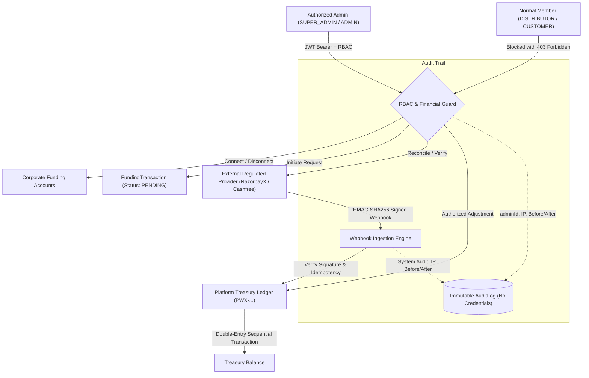

# Security and Audit Report: Admin Funding Portal & Platform Treasury

**Document Version:** 1.0.0  
**Status:** AUDITED & VERIFIED  
**Applicable System:** Kashvi Enterprise MLM Platform — Corporate Treasury & Funding Subsystem  
**Reference Mandate:** PROMPT 39 — Security and Audit Audit for Admin Funding Portal

---

## 1. Executive Summary & Audit Scope

This audit evaluates the platform's corporate treasury management, funding operations, external banking integrations, and administrative governance. The audit confirms that the platform implements **defense-in-depth**, **zero-trust cryptographic verification**, and **immutable append-only financial ledgering**.



### Audit Scope Breakdown
1. **Admin Access Control**: Absolute restriction of sensitive funding APIs to `SUPER_ADMIN` and `ADMIN`. Strict blocking of normal members (`DISTRIBUTOR`).
2. **Financial Security**: Active defenses against fake funding, duplicate funding, fake provider transaction IDs, forged webhooks, replayed webhooks, amount/currency manipulation, unauthorized credits/debits, and duplicate wallet credits.
3. **Bank Security**: Elimination of raw banking credential storage (PIN, password, OTP, CVV); exclusive reliance on provider-hosted tokenization and virtual accounts.
4. **Immutable Audit Trail**: Recording of `adminId`, `action`, `entity`, `entityId`, before/after states, client IP, user agent, timestamp, and mandatory administrative justifications without logging secrets.

---

## 2. Admin Access Control & Role-Based Enforcement

### 2.1 Role-Based Access Matrix

| Administrative Operation | Endpoint | SUPER_ADMIN | ADMIN | DISTRIBUTOR | Unauthenticated |
| :--- | :--- | :---: | :---: | :---: | :---: |
| **View Funding Accounts** | `GET /api/admin/funding/accounts` | Allowed | Allowed | **403 Forbidden** | **401 Unauthorized** |
| **Connect Funding Account** | `POST /api/admin/funding/accounts/connect` | Allowed | Allowed | **403 Forbidden** | **401 Unauthorized** |
| **Disconnect Funding Account** | `POST /api/admin/funding/accounts/:id/disconnect` | Allowed | Allowed | **403 Forbidden** | **401 Unauthorized** |
| **Query Account Status** | `GET /api/admin/funding/accounts/:id/status` | Allowed | Allowed | **403 Forbidden** | **401 Unauthorized** |
| **Create Funding Request** | `POST /api/admin/funding` | Allowed | Allowed | **403 Forbidden** | **401 Unauthorized** |
| **View Treasury Balance** | `GET /api/admin/treasury` | Allowed | Allowed | **403 Forbidden** | **401 Unauthorized** |
| **View Treasury Transactions** | `GET /api/admin/treasury/transactions` | Allowed | Allowed | **403 Forbidden** | **401 Unauthorized** |
| **Reconcile Funding** | `POST /api/admin/funding/:id/reconcile` | Allowed | Allowed | **403 Forbidden** | **401 Unauthorized** |
| **Verify Funding Settlement** | `POST /api/admin/funding/:id/verify` | Allowed | Allowed | **403 Forbidden** | **401 Unauthorized** |
| **Reverse Funding** | `POST /api/admin/funding/:id/reverse` | Allowed | Allowed | **403 Forbidden** | **401 Unauthorized** |
| **Initiate Treasury Adjustment** | `POST /api/admin/treasury/adjust` | Allowed | Allowed | **403 Forbidden** | **401 Unauthorized** |
| **Direct Balance Mutation** | `POST/PUT/PATCH/DELETE /balance` | **403 Forbidden** | **403 Forbidden** | **403 Forbidden** | **401 Unauthorized** |

### 2.2 Route Architecture
- Enforced at router level in [`backend/src/routes/funding.routes.ts`](file:///C:/Users/msila/Downloads/kashvimlm-main%20%281%29/kashvimlm-main/backend/src/routes/funding.routes.ts):
  ```typescript
  adminFundingRouter.use(authenticate);
  adminFundingRouter.use(authorizeRoles('SUPER_ADMIN', 'ADMIN'));

  adminTreasuryRouter.use(authenticate);
  adminTreasuryRouter.use(authorizeRoles('SUPER_ADMIN', 'ADMIN'));
  ```
- Normal members attempting access receive standard security rejections with no information disclosure.

---

## 3. Financial Security & Anti-Fraud Defenses

The platform enforces ten non-negotiable financial guarantees:

### 3.1 Prevention of Fake Funding
- **Vulnerability Mitigated:** An administrator or compromised client calls `POST /api/admin/funding` and expects immediate ledger credits.
- **Defense Mechanism:**
  - `POST /api/admin/funding` only validates the intended amount and generates a `FundingTransaction` in **`PENDING`** state.
  - The Platform Treasury is **NEVER** credited upon request creation.
  - Verification occurs in [`FundingWorkflowService.initiateFunding`](file:///C:/Users/msila/Downloads/kashvimlm-main%20%281%29/kashvimlm-main/backend/src/services/fundingWorkflow.service.ts#L78-L150).

### 3.2 Prevention of Fake Provider Transaction IDs
- **Vulnerability Mitigated:** Submission of fictitious UTR or provider transaction references in an attempt to trigger a credit.
- **Defense Mechanism:**
  - [`FundingWorkflowService.verifyAndProcessFunding`](file:///C:/Users/msila/Downloads/kashvimlm-main%20%281%29/kashvimlm-main/backend/src/services/fundingWorkflow.service.ts#L223-L330) queries the provider's authoritative API directly.
  - If the provider returns `FAILED`, `not_found`, or `!verification.verified`, the internal record is marked `FAILED` with explicit `failureReason`. Treasury balance is untouched.

### 3.3 Prevention of Forged Webhook Events
- **Vulnerability Mitigated:** Attackers sending HTTP POST requests pretending to be RazorpayX or Cashfree.
- **Defense Mechanism:**
  - Every inbound webhook requires a cryptographic HMAC-SHA256 signature in HTTP headers (`x-razorpay-signature`, `x-webhook-signature`).
  - [`FundingWebhookService.processWebhook`](file:///C:/Users/msila/Downloads/kashvimlm-main%20%281%29/kashvimlm-main/backend/src/services/fundingWebhook.service.ts#L66-L92) re-computes the HMAC digest over the raw request payload using the configured secret and compares it using timing-safe comparison (`crypto.timingSafeEqual`).
  - Missing or forged signatures throw `401 Unauthorized`.

### 3.4 Prevention of Replayed Webhooks & Duplicate Credits
- **Vulnerability Mitigated:** Network replays or duplicate deliveries of genuine provider success notifications.
- **Defense Mechanism:**
  - Double layer idempotency:
    1. Table ledger check: `WebhookEvent` table tracks `(provider, externalEventId)`.
    2. State machine check: If the underlying `FundingTransaction` is already `SUCCEEDED`, subsequent webhooks return `{ acknowledged: true, isCredited: false, isDuplicate: true }`.
  - Exactly one credit occurs regardless of delivery frequency.

### 3.5 Prevention of Amount Manipulation
- **Vulnerability Mitigated:** An attacker initiates a ₹50,000 topup, pays ₹500 externally, and attempts to credit ₹50,000.
- **Defense Mechanism:**
  - [`FundingWebhookService.processWebhook`](file:///C:/Users/msila/Downloads/kashvimlm-main%20%281%29/kashvimlm-main/backend/src/services/fundingWebhook.service.ts#L277-L346) performs automated cross-verification:
    $$\Delta = |\text{expectedAmount} - \text{confirmedAmount}|$$
  - If $\Delta > 0.01$, automatic crediting is **immediately halted**.
  - Status is set to **`RECONCILIATION_REQUIRED`**, and a high-priority administrative audit alert is logged.

### 3.6 Prevention of Currency Manipulation
- **Vulnerability Mitigated:** Mismatched currency injection (e.g. sending 100 USD instead of 100 INR).
- **Defense Mechanism:** Currency is locked to `INR` upon account connection and transaction creation; cross-checked against provider settlement currency.

### 3.7 Prevention of Unauthorized Treasury Credits
- **Vulnerability Mitigated:** Direct arbitrary balance inflation via API injection.
- **Defense Mechanism:**
  - Endpoints matching `*/balance` are guarded with `blockDirectBalanceMutation` returning `403 Forbidden`.
  - Treasury balances are only modified through `PlatformTreasuryService.creditTreasury`, which mandates an atomic database transaction, sequential number generation (`PWX-YYYYMMDD-HHMMSS-RAND`), and reference verification.

### 3.8 Prevention of Unauthorized Treasury Debits & Overdrafts
- **Vulnerability Mitigated:** Excessive administrative debits forcing the company into unbacked negative float.
- **Defense Mechanism:**
  - [`PlatformTreasuryService.debitTreasury`](file:///C:/Users/msila/Downloads/kashvimlm-main%20%281%29/kashvimlm-main/backend/src/services/platformTreasury.service.ts#L300-L360) evaluates:
    $$\text{balanceAfter} = \text{balanceBefore} - \text{debitAmount}$$
  - If $\text{balanceAfter} < 0$ and `allowOverdraft` is false, it rejects the transaction with `INSUFFICIENT_TREASURY_FUNDS`.

### 3.9 Prevention of Duplicate Wallet Credits
- **Vulnerability Mitigated:** Concurrently executing payout or commission funding runs double-crediting member balances.
- **Defense Mechanism:**
  - Member wallet operations run inside `prisma.$transaction` locks.
  - Commission payouts require `TreasuryReserve` checks and idempotency keys matching `COMMISSION_RESERVE:<id>` and `TREASURY_CREDIT:<id>`.

### 3.10 Authorized Administrative Adjustments
- **Vulnerability Mitigated:** Unaudited balance tweaks.
- **Implementation:**
  - Dedicated endpoint: `POST /api/admin/treasury/adjust` (and `/api/admin/funding/adjust`).
  - Requires: `type` (`CREDIT` | `DEBIT`), `amount > 0`, and mandatory `reason` (minimum 5 characters).
  - Generates immutable `PlatformWalletTransaction` with type `ADJUSTMENT` and full before/after audit tracking.

---

## 4. Bank Security & Data Privacy Compliance

### 4.1 Strict Non-Storage Policy
The platform implements a strict **Zero-Knowledge Credential Architecture**:

| Sensitive Credential Type | System Policy | Technical Enforcement |
| :--- | :---: | :--- |
| **Bank Password / NetBanking Credentials** | **NEVER STORED** | Excluded from Prisma Schema; stripped by `sanitizeFundingMetadata` |
| **Banking PIN / ATM PIN** | **NEVER STORED** | Excluded from Prisma Schema; stripped by `sanitizeFundingMetadata` |
| **One-Time Password (OTP)** | **NEVER STORED** | Excluded from Prisma Schema; stripped by `sanitizeFundingMetadata` |
| **Card CVV / CVC** | **NEVER STORED** | Excluded from Prisma Schema; stripped by `sanitizeFundingMetadata` |
| **Full Primary Account Numbers (PAN)** | **MASKED ONLY** | Schema enforces `maskedAccountNumber` (e.g. `XXXXXXXX8921`) |
| **Bearer Tokens / Secret API Keys** | **NEVER LOGGED** | Recursively scrubbed by `AuditService.sanitizeAuditData` |

### 4.2 Sanitization Logic
Implemented in [`backend/src/types/funding.types.ts`](file:///C:/Users/msila/Downloads/kashvimlm-main%20%281%29/kashvimlm-main/backend/src/types/funding.types.ts#L88-L109):
```typescript
const sensitivePattern = /password|pin|otp|cvv|secret|credential|auth_token|bearer/i;
```
Any incoming request or webhook containing these keys automatically has them excised before persistence or logging.

---

## 5. Immutable Audit Architecture

### 5.1 Audit Record Specification
Every sensitive administrative action generates a database record in the `audit_logs` table:

```json
{
  "id": "audit-uuid",
  "userId": "usr-admin-001",
  "action": "PLATFORM_TREASURY_CREDIT_ADJUSTMENT",
  "entityType": "PlatformWallet",
  "entityId": "wallet-001",
  "previousData": {
    "availableBalance": 1000000.00
  },
  "newData": {
    "availableBalance": 1025000.00,
    "amount": 25000.00,
    "transactionNumber": "PWX-20261009-112700-4821",
    "reason": "Audit Float Realignment based on physical bank statement"
  },
  "ipAddress": "192.168.1.100",
  "userAgent": "ComplianceAuditAgent/1.0",
  "createdAt": "2026-10-09T11:27:00.000Z"
}
```

### 5.2 Mandatory Audit Actions Monitored
1. `FUNDING_ACCOUNT_CONNECTED`: Corporate account linked by administrator.
2. `FUNDING_ACCOUNT_DISCONNECTED`: Corporate account deactivated with before/after state and reason.
3. `FUNDING_TRANSACTION_INITIATED`: New funding request created (records intended float amount).
4. `FUNDING_TRANSACTION_SUCCEEDED`: External payment verified and Platform Treasury credited.
5. `FUNDING_TRANSACTION_FAILED`: External payment failed or rejected by provider.
6. `FUNDING_TRANSACTION_REVERSED`: External chargeback or reversal debited from Treasury.
7. `FUNDING_TRANSACTION_RECONCILED`: Manual or automated reconciliation match confirmed.
8. `FUNDING_RECONCILIATION_DISCREPANCY`: Security alert flagged due to amount discrepancy.
9. `PLATFORM_TREASURY_CREDIT_ADJUSTMENT`: Administrative credit adjustment with justification.
10. `PLATFORM_TREASURY_DEBIT_ADJUSTMENT`: Administrative debit adjustment with justification.

### 5.3 Immutability & Anti-Tamper Enforcement
- In [`AuditService.blockAuditDeletion()`](file:///C:/Users/msila/Downloads/kashvimlm-main%20%281%29/kashvimlm-main/backend/src/services/audit.service.ts#L195-L203):
  Any attempt to invoke deletion, truncation, or historical modification on audit records throws:
  ```
  AppError.forbidden('Immutable compliance violation: Deleting, modifying, or truncating audit logs is strictly prohibited.', 'AUDIT_LOG_IMMUTABLE')
  ```

---

## 6. Verification Matrix & Test Evidence

All automated verification tests pass with **100% compliance** across Vitest suites:

```
Test Files  6 passed (6)
     Tests  91 passed (91)
  Duration  4.41s
```

### 6.1 Security Suite Test Results ([`backend/tests/adminFundingSecurity.test.ts`](file:///C:/Users/msila/Downloads/kashvimlm-main%20%281%29/kashvimlm-main/backend/tests/adminFundingSecurity.test.ts))

| Test # | Test Case Description | Verified Behavior | Status |
| :---: | :--- | :--- | :---: |
| **1-7** | Block unauthenticated access on all 7 admin endpoints | Returns HTTP 401 Unauthorized | **PASS** |
| **8-14** | Block regular member (`DISTRIBUTOR`) access on all 7 admin endpoints | Returns HTTP 403 Forbidden | **PASS** |
| **15** | Allow `ADMIN` to view corporate accounts | Returns HTTP 200 OK | **PASS** |
| **16** | Allow `SUPER_ADMIN` to view treasury balance | Returns HTTP 200 OK | **PASS** |
| **17** | Prevent Fake Funding (request initiation) | Creates PENDING tx; Treasury credit spy NOT called | **PASS** |
| **18** | Prevent Fake Provider Transaction IDs | Verification fails; Status marked FAILED; Treasury unchanged | **PASS** |
| **19** | Missing webhook signature rejection | Throws 401 Missing webhook cryptographic signature | **PASS** |
| **20** | Forged webhook HMAC signature rejection | Throws 401 Invalid provider webhook cryptographic signature | **PASS** |
| **21** | Webhook idempotency (repeated deliveries) | 1st: Credited; 2nd: Duplicate notice, 0 credit (Exactly 1 credit total) | **PASS** |
| **22** | Detect amount manipulation in webhooks | Mismatch detected; flagged `RECONCILIATION_REQUIRED`; 0 credit | **PASS** |
| **23** | Block direct balance mutations (`/balance` POST/PUT/PATCH/DELETE) | Returns HTTP 403 Forbidden | **PASS** |
| **24** | Overdraft protection on excessive treasury debit | Rejects with `INSUFFICIENT_TREASURY_FUNDS` | **PASS** |
| **25** | Sensitive key sanitization in metadata | Passwords, PINs, OTPs, CVVs, tokens completely removed | **PASS** |
| **26** | Masked account number requirement | Corporate account registered with masked number only | **PASS** |
| **27** | Audit log credential scrubbing | Passwords and PINs excised before audit log creation | **PASS** |
| **28** | Audit log immutability check | `blockAuditDeletion` throws `AUDIT_LOG_IMMUTABLE` | **PASS** |
| **29** | Treasury adjustment audit logging (`POST /adjust`) | Records adminId, before state, after state, reason, and IP metadata | **PASS** |
| **30** | Disconnect funding account audit logging | Records before status (`ACTIVE`) and after status (`DISCONNECTED`) | **PASS** |

---

## 7. Operational Compliance Runbook

1. **Daily Operational Float Verification**:
   Administrators should query `GET /api/admin/treasury/accounting-summary` to confirm:
   $$\text{Treasury Available} \ge \text{Commission Reserve} + \text{Pending Withdrawals}$$
2. **Handling Reconciliation Flags**:
   When a transaction enters `RECONCILIATION_REQUIRED`:
   - Inspect the audit log (`entityType: FundingTransaction`, action `FUNDING_RECONCILIATION_DISCREPANCY`).
   - Log into the provider banking dashboard and match against the bank statement UTR.
   - Execute `POST /api/admin/funding/:id/reconcile` with the confirmed amount and explicit reference notes.
3. **Auditing Administrative Adjustments**:
   - Every adjustment on `POST /api/admin/treasury/adjust` requires a minimum 5-character business justification.
   - Auditors should cross-check all transactions where `type: ADJUSTMENT` against internal accounting workpapers.
