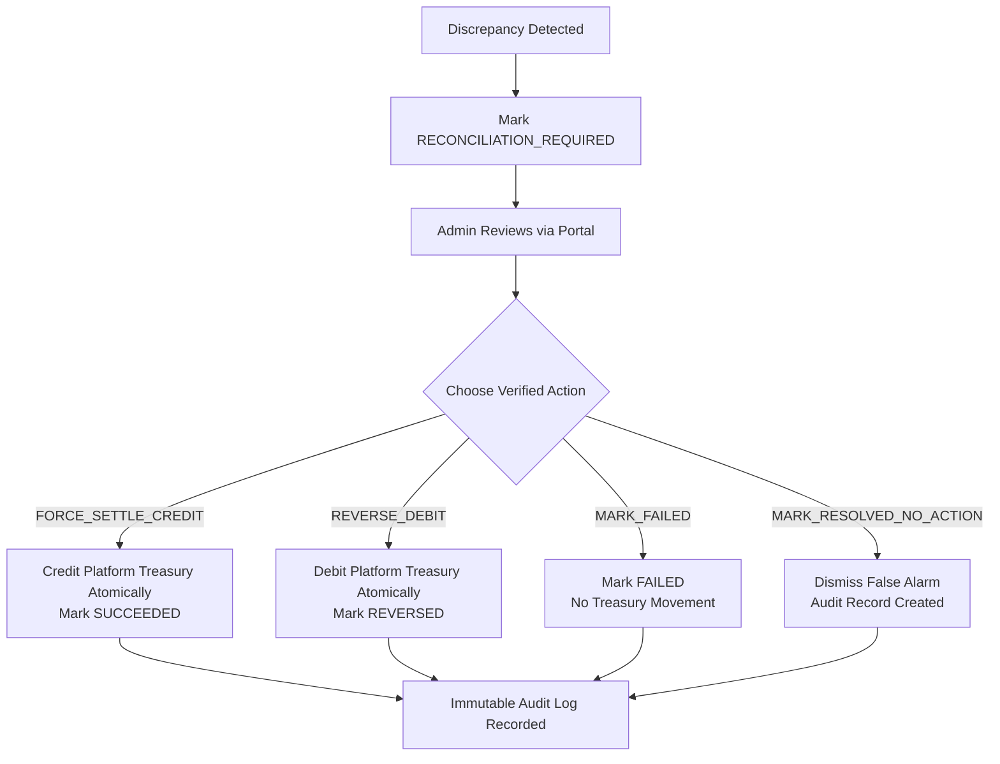

# Bank Funding Reconciliation Guide (Prompt 40)

## Overview & Architecture

The **Bank Funding Reconciliation Engine** implements an authoritative 3-way comparison between the corporate bank/payment provider, internal funding transaction records, and the immutable Platform Treasury Ledger:

```
                    ┌──────────────────────────┐
                    │    External Provider     │
                    │   (RazorpayX, Sandbox)   │
                    └─────────────┬────────────┘
                                  │
                                  ↕ 3-Way Check
                                  │
┌──────────────────────────┐      │      ┌──────────────────────────┐
│    FundingTransaction    │◄─────┴─────►│ Platform Treasury Ledger │
│   (State & Governance)   │             │  (Append-Only Ledger)    │
└──────────────────────────┘             └──────────────────────────┘
```

---

## 3-Way Comparison Layers

| Layer | Component | Source of Truth | Key Fields Checked |
| :--- | :--- | :--- | :--- |
| **Layer 1** | **External Provider** | Regulated Bank Rails / Gateway API / Statement | Status, Settled Amount, Currency, UTR Number, Settled Timestamp |
| **Layer 2** | **FundingTransaction** | Internal Platform Database | Status (`PENDING`, `SUCCEEDED`, etc.), Expected Amount, Currency, Idempotency Key, Provider Tx ID |
| **Layer 3** | **Platform Treasury Ledger** | `PlatformWalletTransaction` | Type (`FUNDING`, `FUNDING_REVERSAL`), Amount, Reference ID, Ledger Continuity |

---

## The 7 Detected Discrepancies

| # | Discrepancy Name | Condition Detected | System Action | Financial Guard |
| :--- | :--- | :--- | :--- | :--- |
| **1** | `EXTERNAL_SUCCESS_INTERNAL_PENDING` | External provider settled (`SUCCEEDED`), but internal status is `PENDING`/`PROCESSING`/`CREATED` and no ledger credit exists. | Marked `RECONCILIATION_REQUIRED` | **No automatic treasury credit** without admin verification. |
| **2** | `EXTERNAL_SUCCESS_NO_INTERNAL_TX` | External provider reports settled deposit in period statement, but no internal `FundingTransaction` exists for the provider transaction ID. | Registered orphan transaction marked `RECONCILIATION_REQUIRED` | Flagged in period reconciliation for admin review. |
| **3** | `INTERNAL_SUCCESS_EXTERNAL_FAILURE` | Internal transaction marked `SUCCEEDED` (or treasury ledger credited), but external provider reports payment `FAILED`, `CANCELLED`, or `NOT_FOUND`. | Marked `RECONCILIATION_REQUIRED` | **No automatic treasury debit**; held for admin inspection. |
| **4** | `AMOUNT_MISMATCH` | External settled amount $\neq$ internal amount, or internal amount $\neq$ ledger credit amount. | Marked `RECONCILIATION_REQUIRED` | Prevents financial discrepancies from entering available float. |
| **5** | `CURRENCY_MISMATCH` | External currency $\neq$ internal transaction currency (e.g. USD vs INR). | Marked `RECONCILIATION_REQUIRED` | Prevents FX drift or foreign currency balance mismatch. |
| **6** | `DUPLICATE_PROVIDER_TRANSACTION` | Multiple `FundingTransaction` records or multiple ledger credits exist for the same external transaction ID. | Marked `RECONCILIATION_REQUIRED` | Prevents double-crediting or duplicate payouts. |
| **7** | `REVERSAL_NOT_REFLECTED_INTERNALLY` | External provider reports transaction `REVERSED`, but internal transaction is `SUCCEEDED` or platform ledger lacks corresponding `FUNDING_REVERSAL` debit. | Marked `RECONCILIATION_REQUIRED` | Alerted for admin resolution and verified debit. |

---

## Absolute Financial Invariants

1. **No Automatic Balance Alteration on Discrepancy**: When any discrepancy is detected during single or period reconciliation, the transaction status is set to `RECONCILIATION_REQUIRED`. Funds are **neither automatically credited nor debited**.
2. **Immutable Audit Trail**: Every discrepancy detection, period reconciliation run, and manual resolution writes an immutable record to `AuditLog` containing:
   - `adminId`
   - `action` (e.g. `FUNDING_RECONCILIATION_DISCREPANCY_DETECTED`, `FUNDING_DISCREPANCY_RESOLVED_FORCE_SETTLE_CREDIT`)
   - `previousData` and `newData`
   - Mandatory resolution reason (minimum 5 characters)
   - Client IP and User-Agent metadata
3. **Atomic Multi-Table State Changes**: Manual resolution actions execute within `prisma.$transaction`, ensuring funding state and ledger entries never desynchronize.

---

## Admin Discrepancy Resolution Workflow

Administrators can review and resolve discrepancies via `POST /api/admin/funding/:id/reconcile/resolve`:



### Resolution Actions
- **`FORCE_SETTLE_CREDIT`**: Admin physically verified external credit through bank statement or banking relationship manager. Credits Platform Treasury with a `FUNDING` ledger transaction and transitions status to `SUCCEEDED`.
- **`REVERSE_DEBIT`**: Admin confirmed chargeback or reversal notice from payment rails. Debits Platform Treasury with a `FUNDING_REVERSAL` ledger transaction and transitions status to `REVERSED`.
- **`MARK_FAILED`**: Admin confirmed payment was uncollected, expired, or dropped. Transitions status to `FAILED` with zero balance movement.
- **`MARK_RESOLVED_NO_ACTION`**: Admin dismissed administrative flag after manual investigation. Preserves current ledger balances and updates resolution metadata.

---

## API Endpoints Reference

### 1. Reconcile Single Transaction
- **Method & Route**: `POST /api/admin/funding/:id/reconcile`
- **Request Headers**: `Authorization: Bearer <Admin_JWT>`
- **Request Body** (optional):
  ```json
  {
    "expectedAmount": 50000,
    "utrNumber": "UTR99881122",
    "notes": "End of day batch reconciliation"
  }
  ```
- **Response** (When Discrepancy Found):
  ```json
  {
    "success": true,
    "statusCode": 200,
    "message": "Discrepancy detected (1 issues). Transaction marked RECONCILIATION_REQUIRED for admin review. No money automatically credited or debited.",
    "data": {
      "transaction": {
        "id": "ftx-12345",
        "status": "RECONCILIATION_REQUIRED",
        "amount": 50000,
        "currency": "INR"
      },
      "isMatched": false,
      "discrepancies": [
        {
          "type": "EXTERNAL_SUCCESS_INTERNAL_PENDING",
          "description": "External provider confirmed SUCCEEDED settlement, but internal transaction remains in PENDING status."
        }
      ]
    }
  }
  ```

### 2. Batch Period Reconciliation
- **Method & Route**: `POST /api/admin/funding/reconcile/period` (also supports `GET`)
- **Request Body**:
  ```json
  {
    "startDate": "2026-10-01T00:00:00.000Z",
    "endDate": "2026-10-09T23:59:59.999Z",
    "provider": "MOCK"
  }
  ```
- **Response**:
  ```json
  {
    "success": true,
    "statusCode": 200,
    "message": "Funding period reconciliation completed: 42 checked, 40 matched, 2 discrepancies detected",
    "data": {
      "period": {
        "startDate": "2026-10-01T00:00:00.000Z",
        "endDate": "2026-10-09T23:59:59.999Z"
      },
      "totalChecked": 42,
      "matchedCount": 40,
      "discrepancyCount": 2,
      "discrepancies": [ ... ]
    }
  }
  ```

### 3. List Flagged Discrepancies
- **Method & Route**: `GET /api/admin/funding/discrepancies?page=1&limit=20`
- **Response**:
  ```json
  {
    "success": true,
    "statusCode": 200,
    "data": [
      {
        "id": "ftx-12345",
        "status": "RECONCILIATION_REQUIRED",
        "amount": 50000,
        "discrepancyDetails": [ ... ],
        "failureReason": "Amount mismatch detected"
      }
    ],
    "meta": {
      "total": 1,
      "page": 1,
      "limit": 20,
      "totalPages": 1
    }
  }
  ```

### 4. Admin Discrepancy Resolution
- **Method & Route**: `POST /api/admin/funding/:id/reconcile/resolve`
- **Request Body**:
  ```json
  {
    "action": "FORCE_SETTLE_CREDIT",
    "reason": "Verified bank credit slip received from corporate banking manager",
    "notes": "Bank reference #HDFC998231",
    "correctionAmount": 50000
  }
  ```
- **Response**:
  ```json
  {
    "success": true,
    "statusCode": 200,
    "message": "Discrepancy successfully resolved via 'FORCE_SETTLE_CREDIT'. Audit record created.",
    "data": {
      "transaction": {
        "id": "ftx-12345",
        "status": "SUCCEEDED"
      },
      "actionTaken": "FORCE_SETTLE_CREDIT",
      "treasuryBalance": 150000,
      "ledgerTransactionNumber": "PWX-20261009-120000-4321"
    }
  }
  ```

---

## Verification & Testing Matrix

| Test Suite | Tests Passing | Key Verified Behaviors |
| :--- | :---: | :--- |
| `tests/fundingReconciliation.test.ts` | **18 / 18** | Detects all 7 named discrepancy scenarios; verifies that no automatic credits/debits happen upon discrepancy; verifies full 3-way match; tests period reconciliation; tests admin review and resolution actions; tests RBAC security. |
| `tests/adminFundingSecurity.test.ts` | **30 / 30** | Verifies zero-credential compliance, HMAC verification, RBAC authorization, and immutable audit logs. |
| `tests/adminFundingApi.test.ts` | **16 / 16** | Tests all admin funding and treasury endpoints, filters, pagination, and balance protection guards. |
| `tests/fundingWorkflow.test.ts` | **16 / 16** | End-to-end admin funding workflow from initiation to verification and settlement. |
| `tests/fundingWebhook.test.ts` | **8 / 8** | Webhook signature verification, replay protection, and discrepancy flagging. |
| `tests/fundingModels.test.ts` | **8 / 8** | Data models, DTO formatting, and credential sanitization. |
| `tests/fundingProvider.test.ts` | **13 / 13** | Provider abstraction contracts and mock implementation. |
| **Total Funding Test Suite** | **109 / 109 (100%)** | All corporate banking, treasury, and reconciliation tests passing. |
