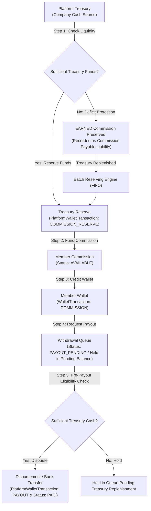

# Treasury & MLM Commission System Integration Architecture (Prompt 37)

## 1. Executive Summary & Core Accounting Principles

In an enterprise multi-level marketing (MLM) platform, financial solvency and auditability require a strict separation between corporate cash and distributor liabilities:

1. **Platform Treasury is the Company's Funding Source**:
   - Represented by `PlatformWallet` (Wallet Code: `PRIMARY_TREASURY`) and the immutable `PlatformWalletTransaction` ledger.
   - Manages corporate deposits, merchant payment settlements, and liquidity injected via regulated corporate funding providers (e.g., RazorpayX, Cashfree).
2. **Member Commissions are Platform Liabilities (Accounts Payable)**:
   - When a distributor generates or qualifies for a commission, the platform incurs a legal payable obligation (`Commission Payable`).
   - Commissions are liabilities owed by the platform, **not** money that magically exists inside the distributor's wallet.
3. **No Direct Balance Overwrites Without Immutable Ledger Entries**:
   - Every movement between the company treasury and distributor balances requires paired, immutable ledger transactions with deterministic idempotency keys and sequential transaction numbers (`PWX-...` and `WTX-...`).
4. **Strict Segregation of Corporate and Member Funds**:
   - Company treasury balances are **never** commingled with individual distributor wallet balances.

---

## 2. The End-to-End Safe Financial Flow



### Flow Breakdown:
1. **Platform Treasury**: Liquid corporate funds available to the business.
2. **Commission Funding/Reserve**: Funds specifically segregated from `availableBalance` to back member commission payables.
3. **Member Commission**: Individual commission ledger record (`CommissionTransaction`) tracking calculation, source order, tier, and status.
4. **Member Wallet**: Distributor account balance (`Wallet`) tracking available funds, pending withdrawal holds, and lifetime earnings.
5. **Withdrawal**: External disbursement from Platform Treasury to member verified bank account.

---

## 3. Strict 6-Status Lifecycle State Machine

Prompt 37 establishes a 6-status lifecycle for MLM commissions:

```
 EARNED  ───►  APPROVED  ───►  AVAILABLE  ───►  PAYOUT_PENDING  ───►  PAID
    │              │               │                     │
    ▼              ▼               ▼                     ▼
 REVERSED ◄──── REVERSED ◄──── REVERSED ◄─────────── REVERSED (Clawback)
```

| Status | Stage | Financial Meaning | Wallet Balance Impact | Treasury Impact |
| :--- | :--- | :--- | :--- | :--- |
| **`EARNED`** | Accrual | Commission is legally earned from order sales volume. Recorded as `Commission Payable` liability. | Increments `lifetimeEarned`. `availableBalance` **NOT** credited. | None (No cash required to earn). |
| **`APPROVED`** | Compliance | Passed business qualification, KYC, and fraud checks; queued for treasury reserving. | None. | None. |
| **`AVAILABLE`** | Funded Reserve | Platform Treasury funds have been formally allocated into `Treasury Reserve`. Ready for withdrawal. | `availableBalance` credited via `WalletTransaction`. | `PlatformWalletTransaction` created (`COMMISSION_RESERVE`). |
| **`PAYOUT_PENDING`** | Withdrawal Hold | Member has requested payout/withdrawal. Funds placed on hold in pending balance. | `availableBalance` decremented, `pendingBalance` held. | Reserved for disbursement. |
| **`PAID`** | Disbursement | Funds disbursed externally to member's verified bank account. | `pendingBalance` released, `lifetimePaid` incremented. | `PlatformWalletTransaction` created (`PAYOUT`), Treasury debited. |
| **`REVERSED`** | Refund/Clawback | Order cancelled or refunded. Commission is nullified. | Compensating deduction via `WalletTransaction` (`REVERSAL`). | Reserve released back to Treasury available balance. |

---

## 4. Separation of Accounting Concepts: Treasury Reserve vs. Commission Payable

To prevent insolvency, the platform distinguishes between **cash reserves** and **liabilities**:

### A. Commission Payable (Platform Liability)
- **Definition**: The total monetary debt owed by the company to its distributors for earned and approved commissions.
- **Formula**:
  $$\text{Commission Payable} = \text{Unfunded Earned} + \text{Approved} + \text{Funded Available} + \text{Pending Payouts}$$
- **Characteristics**:
  - Automatically accrues upon valid order checkout.
  - Represents a legal claim by distributors on the platform.

### B. Treasury Reserve (Earmarked Corporate Cash)
- **Definition**: Corporate liquidity explicitly segregated inside `PlatformWallet` to satisfy accrued Commission Payables.
- **Formula**: Cumulative sum of `PlatformWalletTransaction` where `type = COMMISSION_RESERVE` minus disbursed payouts.
- **Characteristics**:
  - Backed by real fiat deposits (RazorpayX, bank wires).
  - Segregated from general operational expenditure.

### C. Solvency & Liquidity Metrics
The system calculates real-time solvency via `TreasuryCommissionService.getAccountingSummary()`:
- **Reserve Coverage Ratio**:
  $$\text{Reserve Coverage Ratio} = \frac{\text{Treasury Reserve}}{\text{Total Commission Payable}}$$
  *(Target: $\ge 1.0$ — 100% of outstanding payables are backed by earmarked cash reserves)*
- **Total Solvency Ratio**:
  $$\text{Total Solvency Ratio} = \frac{\text{Total Treasury Cash Float}}{\text{Total Commission Payable}}$$
  *(Target: $\ge 1.0$ — Platform cash exceeds all cumulative distributor liabilities)*
- **Net Surplus / Deficit**:
  $$\text{Net Surplus} = \text{Total Treasury Cash} - \text{Total Commission Payable}$$

---

## 5. Non-Deletion Guarantee During Treasury Deficits

### Crucial Invariant:
> **Do NOT automatically prevent commission earning merely because treasury funds are temporarily insufficient.**  
> **The member's earned commission must NOT be silently deleted because the company treasury is low.**

### How the System Enforces This:
1. **Commission Earning Independence**:
   - `TreasuryCommissionService.recordEarnedCommission()` evaluates only order validity, downline tree hierarchy, and member qualification.
   - Treasury cash balance is **never** a prerequisite for registering earned commissions.
   - Even if `PlatformWallet.availableBalance == 0.00`, the commission is recorded in status `EARNED`.
2. **Deficit Handling**:
   - When `fundAndReserveCommission()` is executed and treasury funds are insufficient:
     - The commission is **not** deleted, cancelled, or rejected.
     - The commission is safely preserved in `EARNED` status.
     - The distributor sees their full **EARNED COMMISSION** in their dashboard.
     - Their **AVAILABLE PAYOUT FUNDS** reflect only what has actually been funded.
3. **Automated FIFO Batch Replenishment**:
   - When corporate funding arrives (e.g., admin bank deposit or RazorpayX webhook), `batchFundCommissions()` processes preserved commissions in **First-In, First-Out (FIFO)** order.
   - As treasury funds become available, commissions transition from `EARNED` $\to$ `AVAILABLE`.

---

## 6. Pre-Payout Eligibility Checks & Double-Guard Architecture

Before any payout can transition to `PAID`:
`TreasuryCommissionService.checkPayoutEligibility(payoutId)` enforces a rigorous multi-tier audit:

1. **Member-Tier Guards**:
   - Member profile must be active (not suspended/blocked).
   - Member wallet must not be locked.
   - Payout amount must match held funds in `pendingBalance`.
   - Designated bank account must have verified KYC (`status = VERIFIED`).
2. **Treasury-Tier Guards**:
   - Platform Treasury available balance must exceed the net disbursement amount.
   - Payout must not breach the platform's minimum operational reserve threshold.
3. **Execution Atomicity**:
   - Payout execution debits the Platform Treasury (`PlatformWalletTransaction: PAYOUT`) and updates member wallet within the exact same atomic transaction.

---

## 7. Administrative API Reference

All endpoints enforce strict JWT authentication and role-based access control (`SUPER_ADMIN`, `ADMIN`).

| Method | Endpoint | Description |
| :--- | :--- | :--- |
| **`GET`** | `/api/admin/funding/accounting-summary` | Retrieves comprehensive balance sheet (Treasury cash, Commission Payables, Solvency ratios). |
| **`GET`** | `/api/admin/treasury/accounting-summary` | Alias for accounting summary under the treasury router. |
| **`POST`** | `/api/admin/funding/commissions/reserve-batch` | Runs batch FIFO reserving for earned commissions using available treasury float. |
| **`POST`** | `/api/admin/funding/commissions/:id/reserve` | Funds and reserves a specific individual earned commission. |
| **`GET`** | `/api/admin/funding/payouts/:id/eligibility` | Evaluates whether a payout request satisfies platform treasury and accounting rules. |
| **`POST`** | `/api/admin/funding/payouts/:id/disburse` | Atomically executes payout disbursement with paired platform and member ledger entries. |
